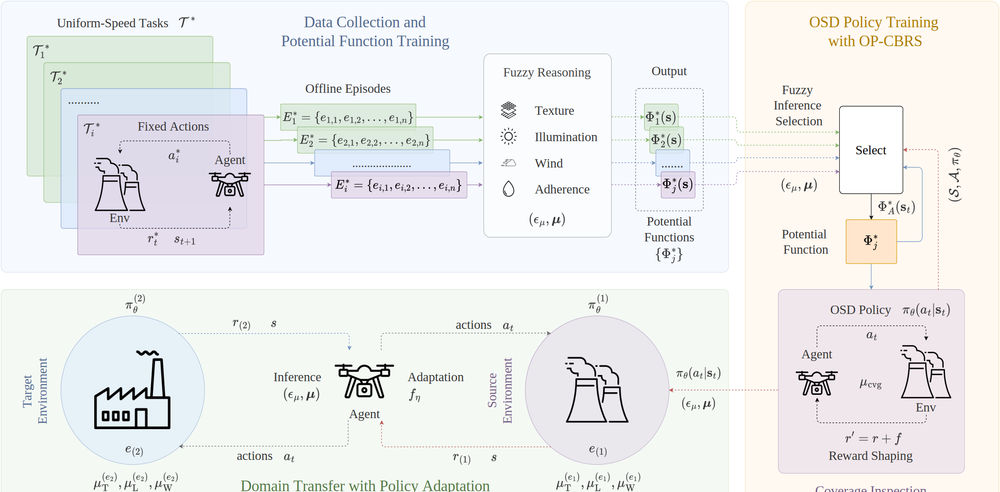
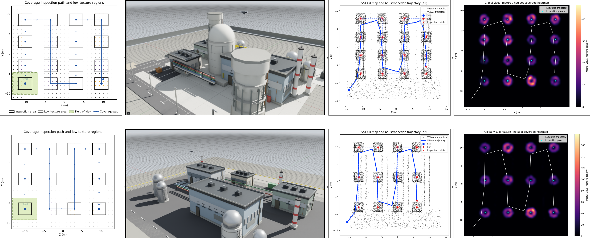
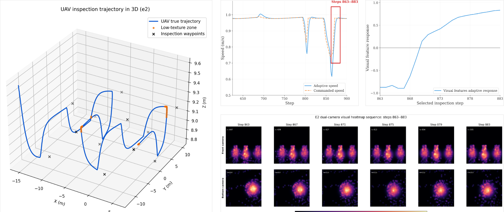
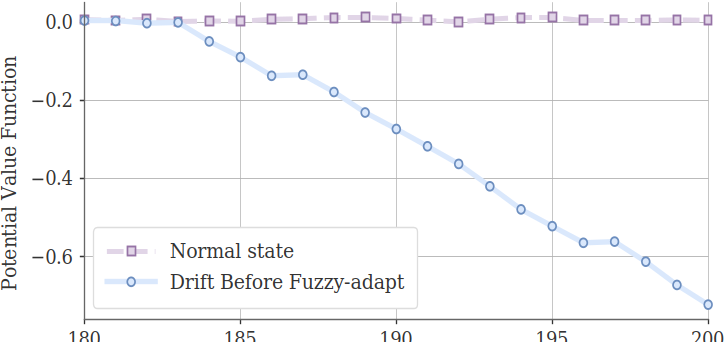
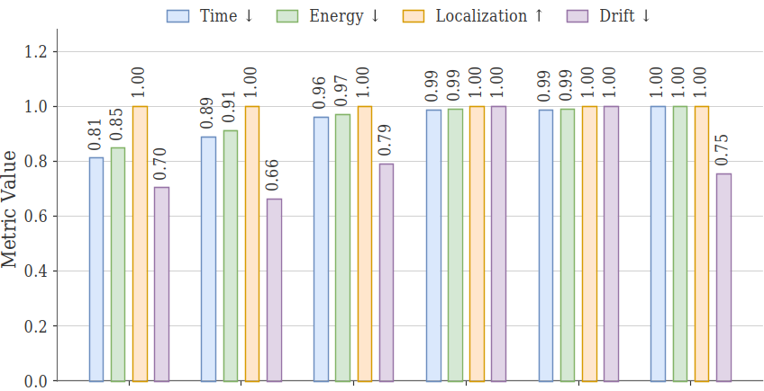
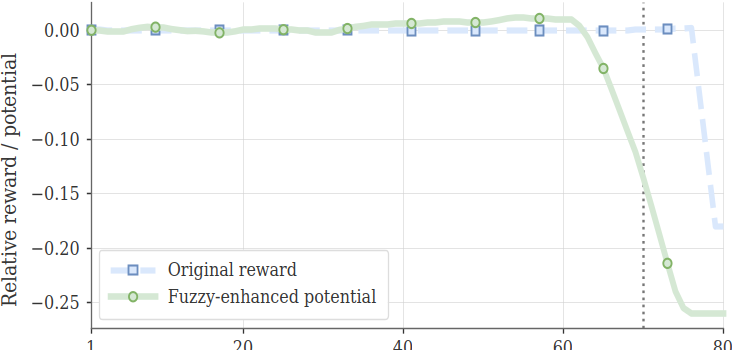

# Autonomous Policy Transfer for GPS-Denied UAV Infrastructure Inspection

**Research Artifact · Isaac Sim / Isaac Lab Implementation**

[](https://www.python.org/)
[](https://developer.nvidia.com/isaac-sim)
[](https://gymnasium.farama.org/)
[](#)
[](#)
[](#)

> **Paper:** Autonomous Policy Transfer for GPS-Denied UAV Infrastructure Inspection  
> **Authors:** Uddin Md. Borhan, Bingqing Du, Arif Raza, Jianqiang Li, and Jie Chen  
> **Affiliation:** College of Computer Science and Software Engineering, Shenzhen University, China  
> **Code entry point:** `source/standalone/npp_drone_inspection/drone.py`

---

## 1. Overview

This repository provides the paper-aligned implementation for autonomous UAV infrastructure inspection in GPS-denied environments.
The framework is designed for long-route inspection where sparse visual texture, illumination variation, wind disturbance, localization drift, and delayed reward feedback jointly affect UAV navigation.

The implementation integrates:

- **PPO-based Deep Reinforcement Learning (DRL)** for Optimal Speed Decision (OSD),
- **Fuzzy reasoning** over visual texture, illumination, wind, and trajectory adherence,
- **Off-Policy Critic-Based Reward Shaping (OP-CBRS)** from offline uniform-speed rollouts,
- **Simulation-to-Simulation (Sim2Sim) policy transfer** from source environment `e1` to target environment `e2`,
- **Proxy-VSLAM / optional cuVSLAM** for GPS-denied localization experiments,
- **Paper-level metrics, system figures, route plots, heatmaps, ablations, and result tables**.

The central objective is to complete multi-waypoint infrastructure inspection while balancing route success, localization reliability, execution time, energy consumption, and drift risk.

---

## 2. System Model and Method Pipeline

The proposed system uses uniform-speed offline tasks to build potential functions, selects fuzzy-adapted potential functions during OSD policy training, and transfers the learned policy from the source power-plant domain to the target industrial domain.

<p align="center">
  
</p>

<p align="center"><b>Fig. 1.</b> System model of the proposed UAV inspection framework.</p>

### Pipeline

```text
Offline uniform-speed tasks
        ↓
Offline episode collection
        ↓
Fuzzy reasoning over texture, illumination, wind, and adherence
        ↓
OP-CBRS potential-function construction
        ↓
Source-domain PPO OSD training in e1
        ↓
Sim2Sim fuzzy recalibration from e1 to e2
        ↓
Target-domain transfer fine-tuning
        ↓
Final target-domain evaluation and result visualization
```

### Domains

| Domain | Description | Route |
|---|---|---|
| `e1` | Source power-plant / nuclear-style inspection domain | 16 waypoints |
| `e2` | Target industrial inspection domain | 12 waypoints |

### Main Components

| Component | Role |
|---|---|
| OSD | Learns adaptive scalar speed between `v_min` and `v_max`. |
| Fuzzy reasoning | Converts texture, illumination, wind, and adherence into interpretable memberships. |
| OP-CBRS | Builds potential-based shaping signals from offline uniform-speed rollouts. |
| Sim2Sim transfer | Recalibrates fuzzy memberships and adapts the source policy to the target domain. |
| Proxy-VSLAM | Simulates GPS-denied pose noise, drift, feature degradation, and tracking quality. |
| cuVSLAM mode | Optional Isaac ROS Visual SLAM odometry input. |

---

## 3. Simulation Environments and Visual Results

The experiments are conducted in Isaac Sim / Isaac Lab with source and target inspection domains.
The figures below summarize route layout, scene rendering, proxy-VSLAM behavior, feature-density heatmaps, trajectory response, OP-CBRS potential behavior, and normalized transfer performance.

### 3.1 Source and Target Domain Visualization

<p align="center">
  
</p>

<p align="center"><b>Fig. 2.</b> Source-domain `e1` and target-domain `e2` visualization, including coverage paths, Isaac Sim scenes, proxy-VSLAM trajectories, and feature-density heatmaps.</p>

### 3.2 Fuzzy-Enhanced OSD Decision-Making

<p align="center">
  
</p>

<p align="center"><b>Fig. 3.</b> Fuzzy-enhanced OSD decision-making in `e2`, showing adaptive trajectory, speed response, visual-feature response, and dual-camera heatmap sequence.</p>

### 3.3 OP-CBRS Potential and Transfer Results

<table>
<tr>
<td align="center" width="33%">

<br/><sub><b>Fig. 4.</b> OP-CBRS potential distinguishes normal and drift-prone states.</sub>
</td>
<td align="center" width="33%">

<br/><sub><b>Fig. 5.</b> Normalized target-domain transfer performance.</sub>
</td>
<td align="center" width="33%">

<br/><sub><b>Fig. 6.</b> Fuzzy-enhanced potential provides earlier pre-drift response.</sub>
</td>
</tr>
</table>

---

## 4. Key Results

### 4.1 Target-Domain `e2` Evaluation

The target-domain evaluation uses 50 episodes per policy.
All policies complete the target route, while the transferred policy achieves the best time-energy efficiency.

| Policy | Episodes | Psucc (%) | τavg (s) | Dinc/Ep. | Aloc (%) | Econ (Wh) | Speed (m/s) |
|---|---:|---:|---:|---:|---:|---:|---:|
| Uniform-Speed-0.25 m/s | 50 | 100.00 | 114.46 | 1.28 | 99.82 | 6.27 | 0.718 |
| Uniform-Speed-0.50 m/s | 50 | 100.00 | 104.46 | 1.36 | 99.83 | 5.82 | 0.788 |
| Uniform-Speed-0.75 m/s | 50 | 100.00 | 96.57 | 1.14 | 99.81 | 5.47 | 0.851 |
| Uniform-Speed-1.00 m/s | 50 | 100.00 | 94.15 | 0.90 | 99.76 | 5.37 | 0.873 |
| Analytic OSD+Fuzzy+OP-CBRS | 50 | 100.00 | 94.15 | 0.90 | 99.76 | 5.37 | 0.873 |
| **Transferred OSD+Fuzzy+OP-CBRS** | **50** | **100.00** | **92.69** | **1.20** | **99.79** | **5.31** | **0.886** |

### 4.2 Welch t-Test Against Same-Protocol `e2` Baselines

The transferred policy is statistically faster and more energy efficient than the analytic OSD and uniform 1.00 m/s baselines.
The drift difference is not statistically significant against the fastest baselines, so the claim is limited to improved time-energy efficiency under full route completion.

| Compared baseline | Δτ (s) | pτ | ΔE (Wh) | pE | ΔDinc/Ep. | pD |
|---|---:|---:|---:|---:|---:|---:|
| Uniform-Speed-0.25 m/s | -21.78 | < 10^-50 | -0.97 | < 10^-50 | -0.08 | 0.693 |
| Uniform-Speed-0.50 m/s | -11.77 | < 10^-35 | -0.52 | < 10^-35 | -0.16 | 0.507 |
| Uniform-Speed-0.75 m/s | -3.88 | 9.60×10^-10 | -0.17 | 7.16×10^-10 | 0.06 | 0.782 |
| Uniform-Speed-1.00 m/s | -1.46 | 0.0196 | -0.064 | 0.0162 | 0.30 | 0.126 |
| Analytic OSD+Fuzzy+OP-CBRS | -1.46 | 0.0196 | -0.064 | 0.0162 | 0.30 | 0.126 |

### 4.3 Ablation Study

The ablation confirms that OP-CBRS is essential for route completion and that OSD provides an explicit speed-regulation mechanism for safety-aware adaptation.

| Configuration | Psucc (%) | τavg (s) | Dinc/Ep. | Aloc (%) | Econ (Wh) | WP |
|---|---:|---:|---:|---:|---:|---:|
| Uniform-speed library (mean) | 100.00 | 102.41 | 1.17 | 99.81 | 5.74 | 12/12 |
| Analytic OSD+Fuzzy+OP-CBRS | 100.00 | 94.15 | 0.90 | 99.76 | 5.37 | 12/12 |
| PPO+OSD+Fuzzy w/o OP-CBRS | 0.00 | 72.00 | 0.96 | 99.07 | 4.04 | 9.58/12 |
| PPO+Fuzzy+OP-CBRS w/o OSD | 100.00 | 88.08 | 0.92 | 99.70 | 5.17 | 12/12 |
| **PPO Sim2Sim Transfer + OP-CBRS** | **100.00** | **92.69** | **1.20** | **99.79** | **5.31** | **12/12** |

### 4.4 Coverage and OP-CBRS Consistency

| Run | Waypoints | C | μcvg | Lib. hit | Alerts |
|---|---:|---:|---:|---:|---:|
| Source `e1` training | 16/16 | 0.500 | 0.393 | 0.550 | 31.20 |
| Transfer `e2` tuning | 12/12 | 0.415 | 0.290 | 0.540 | 2.08 |
| Transfer `e2` evaluation | 12/12 | 0.415 | 0.290 | 0.600 | 1.78 |

### 4.5 Source and Transfer Summary

| Run | Domain | Episodes | Waypoints | Psucc (%) | τavg (s) | Aloc (%) | Econ (Wh) |
|---|---|---:|---:|---:|---:|---:|---:|
| Source PPO training | `e1` | 291 | 16/16 | 100.00 | 96.08 | 97.67 | 5.33 |
| Transfer fine-tuning | `e2` | 50 | 12/12 | 100.00 | 94.01 | 99.81 | 5.36 |
| Final transferred evaluation | `e2` | 50 | 12/12 | 100.00 | 92.69 | 99.79 | 5.31 |
| Best selected episode | `e2` | 1 | 12/12 | 100.00 | 85.20 | 100.00 | 4.99 |

---

## 5. Implementation Parameters

| Category | Parameter / value | Description |
|---|---|---|
| PPO training | `γ=0.95`, `λ=0.98`, `εclip=0.25`, `ηα=6×10^-5`, buffer `1024`, batch `512`, replay cycles `16` | PPO/GAE training and fine-tuning settings. |
| Routes / episodes | `e1`: 16 WP, 291 episodes; `e2`: 12 WP, 50 transfer episodes, 50 evaluation episodes/policy | Route and episode protocol. |
| OSD speeds | `vmin=0.25`, `vmax=1.00` m/s; `(αlow, αmed, αhigh)=(0.50,0.75,1.00)` m/s | Scalar speed bounds and OSD centers. |
| Fuzzy texture | `e1`: medium/high = `(8,15)`; `e2`: medium/high = `(5,10)` features/frame | Domain-specific texture thresholds for `μT`. |
| Illumination / wind | `e1`: 450–550 lux, wind 2 m/s; `e2`: 360–440 lux, wind 5 m/s | Recalibration for `μL` and `μW`. |
| Adherence / localization | `εmin=0.25 m`, `εmax=1.50 m`, localization threshold `0.10 m`, drift threshold `0.50 m` | Route-adherence and localization limits. |
| Fuzzy coverage | `wT=0.55`, `wL=0.30`, `wW=0.15`, radius `1.25 m` | Coverage aggregation weights. |
| Events / safety | `Rg=18.0`, completion bonus `65.0`, collision `-15.0`, near-obstacle `-5.0`, `Rd=-0.35` | Sparse task, safety, and drift constants. |
| OP-CBRS selection | `(ε1,ε2)=(0.7,0.6)` in `e1`, `(0.6,0.5)` in `e2`; blend `0.70/0.30` | Selection thresholds and fallback blend. |

---

## 6. Repository Layout

```text
IsaacLab/
├── source/
│   └── standalone/
│       └── npp_drone_inspection/
│           ├── drone.py
│           ├── models/
│           └── logs/
├── figs/
│   ├── 1.png   # System model
│   ├── 2.png   # Source/target route, scene, VSLAM, heatmap
│   ├── 3.png   # 3D trajectory, speed response, dual-camera heatmap
│   ├── 4.png   # OP-CBRS potential comparison
│   ├── 5.png   # Normalized transfer performance
│   └── 6.png   # Reward vs fuzzy-enhanced potential
└── README.md

~/uav_inspection/
├── logs/
├── metrics/
├── figures/
├── trajectories/
├── models/
├── op_cbrs/
├── paper_selected_figures/
└── paper/
```

---

## 7. Environment Requirements

### Required

- Ubuntu 20.04 / 22.04
- NVIDIA GPU recommended
- Isaac Sim / Isaac Lab
- Python 3.10 through Isaac Lab
- `gymnasium`
- `numpy`
- `pandas`
- `zip` and `rsync`

### Optional

- Isaac ROS Visual SLAM / cuVSLAM
- ROS 2 Humble
- Custom drone USD / USDZ asset
- Custom industrial or power-plant USD asset
- HDRI environment map

Run the script through Isaac Lab:

```bash
cd ~/IsaacLab
./isaaclab.sh -p source/standalone/npp_drone_inspection/drone.py --help
```

Do **not** run `drone.py` with a normal system Python interpreter.

---

## 8. Code Tour

| Module / class | Purpose |
|---|---|
| `parse_args()` | Defines experiment controls such as mode, device, SLAM mode, output paths, training steps, and OSD speed bounds. |
| `CuvslamOdomReceiver` | Receives external cuVSLAM odometry using direct `rclpy` subscription or UDP JSON fallback. |
| `NPPDroneGymEnv` | Main Gymnasium environment for scene creation, UAV motion, proxy-SLAM, reward logic, route logic, metrics, and figures. |
| Scene construction functions | Build source and target environments, visual landmarks, drone body, sensor rigs, stereo cameras, and ROS 2 camera graph. |
| Proxy-VSLAM logic | Simulates GPS-denied pose noise, yaw noise, velocity noise, drift, and tracking loss. |
| OP-CBRS library | Stores and selects fuzzy-binned potential functions from offline uniform-speed rollouts. |
| PPO / transfer modes | Train source OSD policy, fine-tune in target domain, and evaluate baselines or transferred policies. |

---

## 9. Main Output Metrics

| Metric | Meaning |
|---|---|
| `Psucc_episode` | Route success indicator. |
| `tau_i_sec` | Episode execution time. |
| `Dinc_episode` | Number of drift incidents. |
| `Aloc_episode` | Localization accuracy indicator. |
| `Econ_Wh_episode` | Estimated energy consumption. |
| `Etime_sec_episode` | Effective mission time. |
| `coverage_C` | Coverage score. |
| `mu_cvg_final` | Final fuzzy coverage membership. |
| `waypoints_reached` | Number of reached inspection waypoints. |
| `pre_drift_alerts` | Number of pre-drift fuzzy warnings. |
| `mean_speed_mps` | Mean scalar speed. |
| `mean_mu_T`, `mean_mu_L`, `mean_mu_W`, `mean_mu_A` | Texture, illumination, wind, and adherence memberships. |
| `reward_sum` | Raw environment return. |
| `performance_reward_sum` | Performance-oriented reward for paper plots. |
| `op_cbrs_lib_hits` | Number of OP-CBRS library hits. |
| `op_cbrs_lib_misses` | Number of OP-CBRS library misses. |

---

## 10. Quick Start

### 10.1 Place the script

```bash
mkdir -p ~/IsaacLab/source/standalone/npp_drone_inspection
cp drone.py ~/IsaacLab/source/standalone/npp_drone_inspection/drone.py
```

### 10.2 Check the command-line interface

```bash
cd ~/IsaacLab
./isaaclab.sh -p source/standalone/npp_drone_inspection/drone.py --help
```

### 10.3 Run a short debug evaluation

```bash
cd ~/IsaacLab
export DEVICE=${DEVICE:-cuda}

./isaaclab.sh -p source/standalone/npp_drone_inspection/drone.py \
  --mode random --headless --device $DEVICE --slam-mode proxy \
  --sim-env-id e1 --output-root ~/uav_inspection \
  --max-episode-steps 1000 --inspection-reach-radius 2.00 \
  --disable-obstacle-randomization --disable-collision-termination \
  --num-obstacles 0
```

---

## 11. Full Paper Reproduction Commands

### Step 0: Initialize folders

```bash
cd ~/IsaacLab
export DEVICE=${DEVICE:-cuda}

rm -rf ~/uav_inspection
rm -rf source/standalone/npp_drone_inspection/logs/PPO_*
mkdir -p ~/uav_inspection/{logs,metrics,figures,trajectories,models,op_cbrs,paper_selected_figures}
```

### Step 1: Collect uniform-speed rollouts in `e1`

```bash
./isaaclab.sh -p source/standalone/npp_drone_inspection/drone.py \
  --mode collect_uniform_speed --headless --device $DEVICE --slam-mode proxy \
  --sim-env-id e1 --output-root ~/uav_inspection \
  --offline-episodes-per-speed 25 --uniform-speeds 0.25,0.50,0.75,1.00 \
  --max-episode-steps 12000 --inspection-reach-radius 2.00 \
  --disable-domain-randomization --disable-obstacle-randomization \
  --disable-collision-termination --num-obstacles 0 \
  --policy-analytic-blend 0.75 --adaptive-speed-floor 0.55 \
  --yaw-gain 2.35 --velocity-memory 0.70
```

### Step 2: Build OP-CBRS library

```bash
./isaaclab.sh -p source/standalone/npp_drone_inspection/drone.py \
  --mode build_op_cbrs_library --headless --device $DEVICE --slam-mode proxy \
  --sim-env-id e1 --output-root ~/uav_inspection \
  --potential-library ~/uav_inspection/op_cbrs/op_cbrs_library.json \
  --uniform-speeds 0.25,0.50,0.75,1.00 --max-episode-steps 6000 \
  --inspection-reach-radius 2.00 --disable-domain-randomization \
  --disable-obstacle-randomization --disable-collision-termination \
  --num-obstacles 0 --policy-analytic-blend 0.75 --adaptive-speed-floor 0.55 \
  --yaw-gain 2.35 --velocity-memory 0.70
```

### Step 3: Train source PPO OSD policy in `e1`

```bash
./isaaclab.sh -p source/standalone/npp_drone_inspection/drone.py \
  --mode train_e1_osd --headless --device $DEVICE --slam-mode proxy \
  --sim-env-id e1 --output-root ~/uav_inspection \
  --metrics-dir ~/uav_inspection/train_metrics_e1_final \
  --trajectory-dir ~/uav_inspection/train_trajectories_e1_final \
  --figure-dir ~/uav_inspection/train_figures_e1_final \
  --disable-paper-figures --potential-library ~/uav_inspection/op_cbrs/op_cbrs_library.json \
  --total-timesteps 350000 --osd-vmin 0.25 --osd-vmax 1.00 \
  --max-episode-steps 4000 --inspection-reach-radius 2.00 \
  --disable-obstacle-randomization --disable-collision-termination \
  --num-obstacles 0 --policy-analytic-blend 0.0 \
  --adaptive-speed-floor 0.45 --yaw-gain 2.15 --velocity-memory 0.74
```

### Step 4: Transfer to target domain `e2`

```bash
./isaaclab.sh -p source/standalone/npp_drone_inspection/drone.py \
  --mode transfer_e2 --headless --device $DEVICE --slam-mode proxy \
  --sim-env-id e2 --output-root ~/uav_inspection \
  --metrics-dir ~/uav_inspection/train_metrics_e2_transfer_final \
  --trajectory-dir ~/uav_inspection/train_trajectories_e2_transfer_final \
  --figure-dir ~/uav_inspection/train_figures_e2_transfer_final \
  --disable-paper-figures --potential-library ~/uav_inspection/op_cbrs/op_cbrs_library.json \
  --source-model ~/uav_inspection/models/osd_fuzzy_opcbrs_source_e1.zip \
  --transfer-episodes 50 --transfer-timesteps 600000 \
  --osd-vmin 0.25 --osd-vmax 1.00 --max-episode-steps 4000 \
  --inspection-reach-radius 2.00 --disable-obstacle-randomization \
  --disable-collision-termination --num-obstacles 0 \
  --policy-analytic-blend 0.65 --adaptive-speed-floor 0.55 \
  --yaw-gain 2.35 --velocity-memory 0.70
```

### Step 5: Evaluate target-domain baselines

```bash
./isaaclab.sh -p source/standalone/npp_drone_inspection/drone.py \
  --mode eval_baselines --headless --device $DEVICE --slam-mode proxy \
  --sim-env-id e2 --output-root ~/uav_inspection \
  --metrics-dir ~/uav_inspection/eval_metrics_e2_baselines_final \
  --trajectory-dir ~/uav_inspection/eval_trajectories_e2_baselines_final \
  --figure-dir ~/uav_inspection/eval_figures_e2_baselines_final \
  --potential-library ~/uav_inspection/op_cbrs/op_cbrs_library.json \
  --eval-episodes 50 --uniform-speeds 0.25,0.50,0.75,1.00 \
  --osd-vmin 0.25 --osd-vmax 1.00 --max-episode-steps 12000 \
  --inspection-reach-radius 2.00 --heatmap-grid-size 120 \
  --disable-obstacle-randomization --disable-collision-termination \
  --num-obstacles 0 --policy-analytic-blend 0.75 \
  --adaptive-speed-floor 0.55 --yaw-gain 2.35 --velocity-memory 0.70
```

### Step 6: Evaluate final transferred policy

```bash
./isaaclab.sh -p source/standalone/npp_drone_inspection/drone.py \
  --mode eval_transfer --headless --device $DEVICE --slam-mode proxy \
  --sim-env-id e2 --output-root ~/uav_inspection \
  --metrics-dir ~/uav_inspection/eval_metrics_e2_transfer_final \
  --trajectory-dir ~/uav_inspection/eval_trajectories_e2_transfer_final \
  --figure-dir ~/uav_inspection/eval_figures_e2_transfer_final \
  --potential-library ~/uav_inspection/op_cbrs/op_cbrs_library.json \
  --transfer-model ~/uav_inspection/models/osd_fuzzy_opcbrs_transfer_e2.zip \
  --eval-episodes 50 --osd-vmin 0.25 --osd-vmax 1.00 \
  --max-episode-steps 12000 --inspection-reach-radius 2.00 \
  --heatmap-grid-size 120 --disable-obstacle-randomization \
  --disable-collision-termination --num-obstacles 0 \
  --policy-analytic-blend 0.85 --adaptive-speed-floor 0.65 \
  --yaw-gain 2.45 --velocity-memory 0.66
```

---

## 12. Add Figures to GitHub

Create a `figs/` folder in the repository root and place the six images there:

```bash
mkdir -p figs
cp 1.png figs/1.png
cp 2.png figs/2.png
cp 3.png figs/3.png
cp 4.png figs/4.png
cp 5.png figs/5.png
cp 6.png figs/6.png
```

Then commit:

```bash
git add README.md figs/
git commit -m "Update README with system model, result figures, and result tables"
```

---

## 13. Troubleshooting

### `Could not import isaacsim.SimulationApp`

Run the script through Isaac Lab Python:

```bash
cd ~/IsaacLab
./isaaclab.sh -p source/standalone/npp_drone_inspection/drone.py --help
```

### CUDA is not available

Use CPU mode for debugging:

```bash
export DEVICE=cpu
```

### No ROS 2 camera images in cuVSLAM mode

Check topics:

```bash
ros2 topic list | grep front_stereo_camera
```

Also confirm that Isaac Sim ROS 2 Bridge is enabled and the Isaac timeline is playing.

### Final metrics are missing

Check whether the expected CSV files exist:

```bash
ls -lh ~/uav_inspection/eval_metrics_e2_transfer_final/paper_episode_metrics.csv
ls -lh ~/uav_inspection/eval_metrics_e2_baselines_final/paper_episode_metrics.csv
ls -lh ~/uav_inspection/models/osd_fuzzy_opcbrs_transfer_e2.zip
```

---

## 14. Reproducibility Checklist

- [ ] `drone.py` is located at `~/IsaacLab/source/standalone/npp_drone_inspection/drone.py`.
- [ ] All commands are run from `~/IsaacLab`.
- [ ] `DEVICE` is set to `cuda` or `cpu`.
- [ ] OP-CBRS library exists at `~/uav_inspection/op_cbrs/op_cbrs_library.json`.
- [ ] Source model exists at `~/uav_inspection/models/osd_fuzzy_opcbrs_source_e1.zip`.
- [ ] Transfer model exists at `~/uav_inspection/models/osd_fuzzy_opcbrs_transfer_e2.zip`.
- [ ] Final `e2` baseline metrics exist.
- [ ] Final `e2` transfer metrics exist.
- [ ] `figs/1.png` to `figs/6.png` are committed.
- [ ] README figures render correctly on GitHub.

---

## 15. Citation

```bibtex
@article{borhan2026autonomous,
  title   = {Autonomous Policy Transfer for GPS-Denied UAV Infrastructure Inspection},
  author  = {Borhan, Uddin Md. and Du, Bingqing and Raza, Arif and Li, Jianqiang and Chen, Jie},
  journal = {IEEE Transactions on Intelligent Vehicles},
  year    = {2026},
  note    = {Manuscript under review / preprint}
}
```

---

## 16. License

Add the project license before public release.
Recommended options are MIT, Apache-2.0, or a custom academic-use license.
