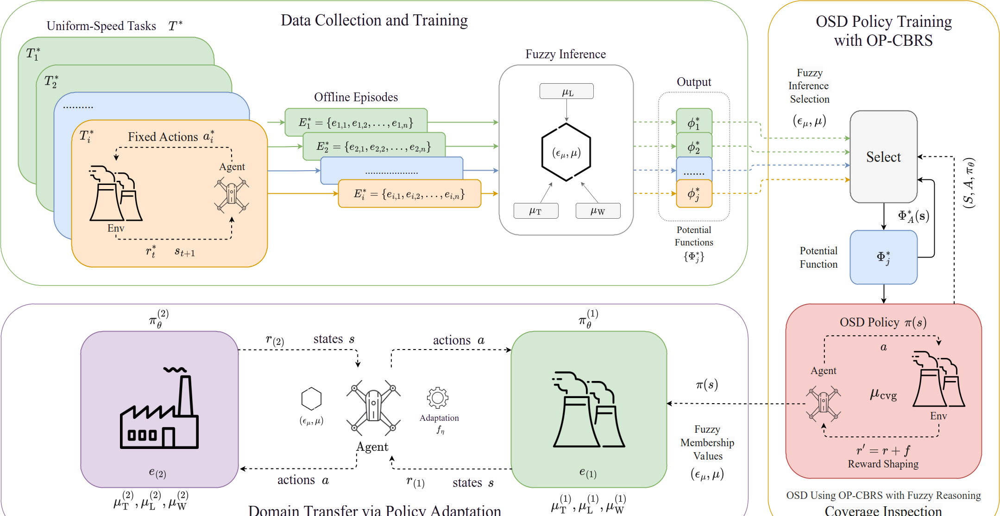
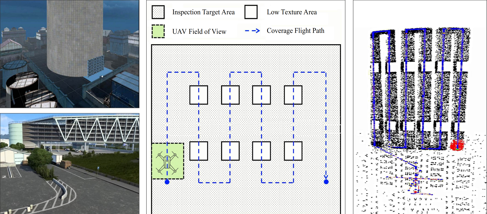
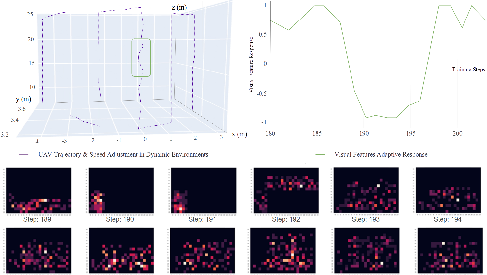
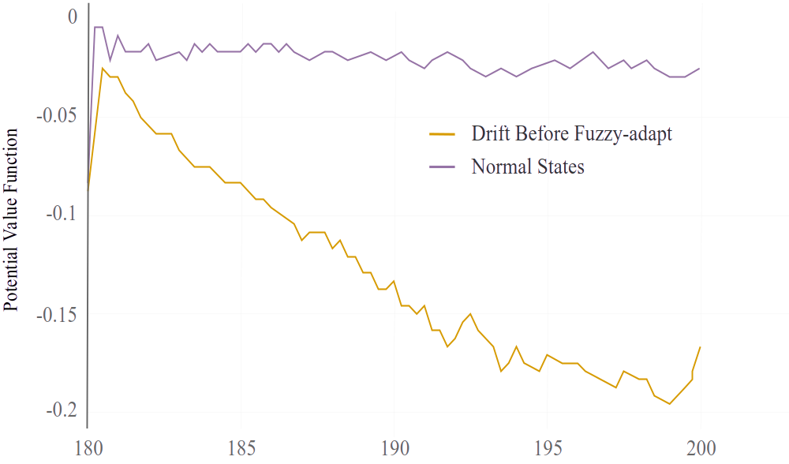
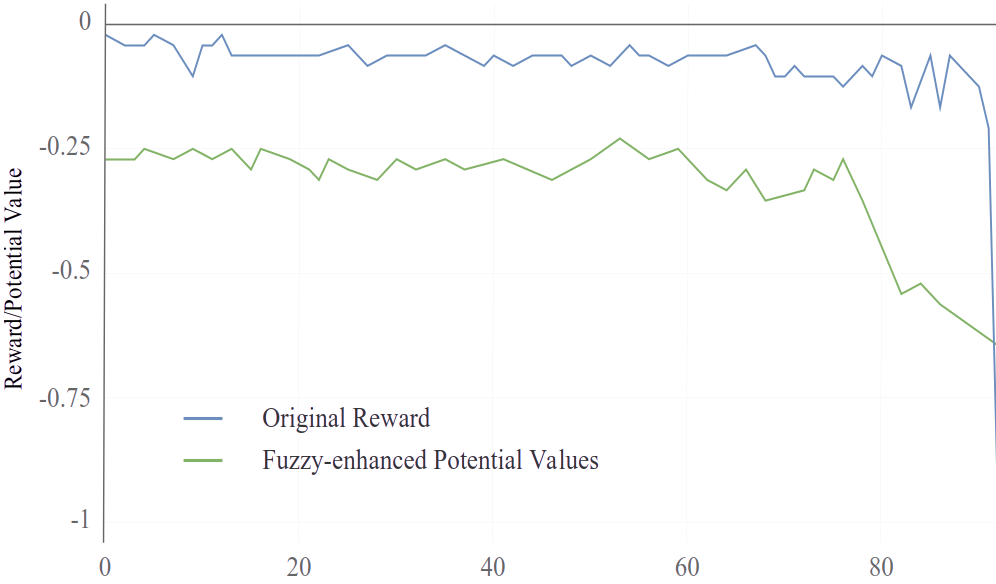

# Autonomous UAV Policy Transfer for Robust Urban Infrastructure Inspection

**Research Artifact · Manuscript-aligned Implementation**

[](https://python.org)
[](https://www.ros.org)
[](https://gazebosim.org)
[](https://flightmare.readthedocs.io)
[](https://pytorch.org)
[](https://github.com/UZ-SLAMLab/ORB_SLAM3)

> **Uddin Md. Borhan, Bingqing Du, Jianqiang Li, Jie Chen**  
> College of Computer Science and Software Engineering, Shenzhen University, China  
> National Engineering Laboratory for Big Data System Computing Technology, Shenzhen University, China  
> Corresponding authors: chenjie@szu.edu.cn, lijq@szu.edu.cn

---

## Overview

<p align="justify">
This repository contains the manuscript-aligned implementation of a Deep Reinforcement Learning (DRL) framework for <b>autonomous UAV-based urban infrastructure inspection in GPS-denied environments</b>. The implementation centers on a <b>PPO-based Optimal Speed Decision (OSD) policy</b> augmented with <b>fuzzy reasoning</b>, <b>Off-Policy Critic-Based Reward Shaping (OP-CBRS)</b>, and <b>Simulation-to-Simulation (Sim2Sim) policy transfer</b>. The current release is organized around the notebook <code>uav_inspection_drl.ipynb</code>, which preserves the original ROS + Flightmare + ORB-SLAM3 workflow while aligning the state, reward, and transfer interfaces with the manuscript.
</p>

The framework addresses four tightly coupled challenges in autonomous coverage inspection:
1. <b>Low-texture GPS-denied inspection:</b> constant-speed flight in visually sparse regions degrades VSLAM quality, increases drift incidents, and reduces localization reliability.
2. <b>Sparse-reward policy learning:</b> waypoint-only rewards slow PPO convergence and provide weak learning signals in long-horizon inspection missions.
3. <b>Static coverage assessment:</b> binary waypoint verification cannot adapt to texture, illumination, and wind uncertainty during coverage execution.
4. <b>Cross-domain policy degradation:</b> policies trained in one simulated inspection scene can fail in another without semantic recalibration of environmental cues.

---

## Unified System Model

<p align="center">
  
</p>

<p align="justify">
The unified framework combines offline uniform-speed coverage data, fuzzy inference, OP-CBRS potential-function selection, PPO-based OSD learning, and Sim2Sim fuzzy-rule adaptation within one continuous inspection-control loop. Offline inspection episodes build a reusable library of potential functions, while the online policy dynamically chooses speed commands according to feature density, environmental uncertainty, and anticipated drift risk.
</p>

---

## Architecture

```text
Offline uniform-speed coverage tasks T*
        |
        v
Collect inspection episodes E1*, E2*, ..., Ei*
        |
        v
Fuzzy inference over environmental semantics
  F = [mu_T, mu_L, mu_W, mu_A]
  mu_T : texture richness
  mu_L : illumination stability (proxy-supported)
  mu_W : wind intensity (proxy-supported)
  mu_A : trajectory adherence
        |
        v
PotentialFunctionLibrary  [OP-CBRS]
  Phi* = {phi_1*, phi_2*, ..., phi_j*}
  make_uniform_speed_potential(agent)
        |
        v
TestEnv  [online inspection wrapper]
  visual state + IMU bias + fuzzy descriptors
  pooled visual features (384) + dynamic/fuzzy features (10)
  total state dim = 394  [FC policy mode]
        |
        v
AgentPPO
  ActorFc / CriticFc
  action a_t : adaptive speed control
  reward = W_E * R_E + W_G * R_G + R_cvg
        |
        +--- OP-CBRS shaping:
        |      r'_t = r_t + gamma * Phi(s_t) - Phi(s_{t+1})
        |
        +--- Coverage reward:
        |      R_cvg = w_cvg * (C_{t+1} - C_t)
        |
        +--- Sim2Sim transfer:
               apply_sim2sim_transfer()
               rescale fuzzy semantics between e1 and e2
```

---

## Method Details

This section summarizes how the framework is realized in the current notebook implementation.

### 1. Inspection MDP and OSD Policy

**Core notebook components:** `TestEnv`, `AgentPPO`, `ActorFc`, `CriticFc`, `PPO_Config`  
**Environment wrappers:** `UavController`, `Env`  
**Path utilities:** `GenRoutePointSet`, `CoveragePathPlanner`, `CoveragePathPlanner_2`, `FollowByLOS`, `CalcNextPoint`, `FollowingTrajBySlam`

The inspection problem is modeled as a continuous decision-making process in which the UAV must move between waypoints while preserving visual localization quality. The effective state is built from:

```text
S_t = [X_t, v_t, b_t, F_t]
X_t : pooled visual-feature observation
v_t : motion / velocity context
b_t : IMU bias / inertial drift context
F_t : [mu_T, mu_L, mu_W, mu_A]
```

In the notebook's fully connected policy configuration, the state vector uses:

```text
384 pooled visual features + 10 dynamic/fuzzy features = 394 dimensions
action_dim = 1  (speed control)
```

The OSD policy learns a continuous speed-selection behavior rather than relying on a fixed traversal velocity. This directly targets the central inspection trade-off: <b>slow enough to stabilize VSLAM in low-texture regions, but fast enough to preserve mission efficiency</b>.

The PPO defaults in the notebook are aligned with the manuscript setup:

```python
gamma = 0.95
lambda_gae_adv = 0.98
ratio_clip = 0.25
learning_rate = 6e-5
batch_size = 512
horizon_len = 1024
repeat_times = 16
```

---

### 2. Fuzzy Intelligence and Adaptive Coverage Reasoning

**Classes:** `FuzzyDomainConfig`, `FuzzyInferenceEngine`  
**Environment methods:** `get_fuzzy_memberships()`, `getRewardCoverageImprovement()`

The fuzzy front-end adds uncertainty-aware semantics to the original PPO workflow. The current implementation exposes the following fuzzy quantities:

```text
mu_T : texture membership from visual feature density
mu_L : illumination membership from a configurable illumination proxy
mu_W : wind membership from a configurable wind proxy
mu_A : trajectory adherence membership from pose-estimation error
mu_cvg : fuzzy coverage quality
```

The implemented coverage aggregation is lightweight and explicit:

```python
mu_cvg = 0.45 * mu_T + 0.30 * mu_L + 0.25 * mu_W
```

This lets the policy reason about inspection quality continuously rather than through a rigid visited / not-visited criterion. Coverage quality is then converted into an incremental reward:

```python
R_cvg = coverage_reward_weight * (coverage_score - prev_coverage_score)
```

The practical effect is straightforward:
- texture-rich, stable regions permit more aggressive traversal,
- low-texture or unstable regions encourage cautious motion,
- coverage quality becomes part of the online reward rather than a post-hoc metric only.

---

### 3. OP-CBRS Reward Shaping

**Classes / functions:** `PotentialFunctionLibrary`, `make_uniform_speed_potential()`  
**Online integration:** `attach_op_cbrs()`, `shape_reward()`

Sparse rewards are mitigated by learning potential functions from simpler offline coverage tasks executed at fixed speeds. These potentials are stored in a reusable OP-CBRS library and injected into the online reward:

```python
r'_t = r_t + gamma * Phi(s_t) - Phi(s_{t+1})
```

In the current implementation, the online base reward is assembled as:

```python
base_reward = W_E * curRe + W_G * curRg + curRcvg
```

and then shaped by the selected potential function:

```python
reward, shape_info = op_cbrs.shape_reward(
    base_reward,
    ft_state, imu_state,
    next_ft_state, next_imu_state,
    action_value,
    memberships,
    recent_actions,
)
```

The potential-function selection is context-aware. When texture drops severely, the library explicitly prefers a more conservative shaping prior:

```python
if mu_T < 0.25:
    choose lowest-speed conservative potential
```

This produces denser and more informative gradients than waypoint-only feedback, which is especially useful near pre-drift conditions and visually sparse surfaces.

---

### 4. Sim2Sim Policy Transfer

**Function:** `apply_sim2sim_transfer()`  
**Fuzzy adaptation hook:** `rescale_for_transfer()`

The Sim2Sim component preserves the trained PPO policy while recalibrating the fuzzy semantics of the target environment. Instead of retraining the whole system from scratch, the transfer utility adapts the membership scales of texture, illumination, and wind:

```python
texture_low, texture_mid, texture_high   <- scaled by source / target texture stats
illumination_band                        <- rescaled to target variability
wind_band                                <- rescaled to target variability
```

This is a minimal but important design choice. The transferred policy retains its decision structure, while the fuzzy front-end reinterprets the target scene according to its own environmental statistics. In practice, this is how the framework bridges the semantic gap between:

- <b>e1:</b> nuclear power plant containment shell, and
- <b>e2:</b> industrial inspection area.

---

### 5. Training Loop and Inspection Execution

**Execution wrapper:** `TestEnv.step()`  
**Tracking / correction helpers:** `checkIsDeviated`, `calcDeviatedDist`, `ReAlignSLAM`, `calcAlignT`, `umeyama_alignment`

The online inspection loop blends path tracking, VSLAM-aware reward evaluation, fuzzy reasoning, and optional OP-CBRS shaping:

```text
1. Generate or follow coverage waypoints
2. Execute short-horizon motion toward the next point
3. Read current visual state, IMU context, and pose estimates
4. Compute R_E (error), R_G (progress), and R_cvg (coverage improvement)
5. Build fuzzy memberships [mu_T, mu_L, mu_W, mu_A, mu_cvg]
6. Shape the reward with OP-CBRS if enabled
7. Update PPO using collected transitions
8. Recalibrate fuzzy semantics for transfer experiments when needed
```

The notebook is deliberately close to the original project workflow: ROS topics, Flightmare interactions, VSLAM alignment, and inspection-path utilities are preserved, while the paper-facing additions remain modular and lightweight.

---

## Repository Layout

```text
autonomous-uav-inspection/
├── uav_inspection_drl.ipynb        <- manuscript-aligned notebook implementation
├── README.md
└── figs/
    ├── coverage_inspection.png     <- UAV coverage planning and inspection scenes
    ├── op-cbrs.png                 <- OP-CBRS training / transfer pipeline
    ├── potential_function.png      <- pre-drift vs. normal-state potential curves
    ├── reward_func.png             <- original reward vs. fuzzy-enhanced shaping
    └── visual_data.png             <- adaptive trajectory and feature-response view
```

<p align="justify">
This layout reflects the files used in the current release. If you later split the notebook into standalone scripts, the README structure can be kept intact by mapping the existing notebook sections into separate modules for environment, policy, transfer, and plotting.
</p>

---

## Requirements

The current implementation depends on both robotics middleware and deep learning libraries:

- Ubuntu 20.04 / 22.04
- ROS (Noetic recommended)
- Gazebo
- Flightmare
- ORB-SLAM3 / VI-SLAM pipeline
- Python 3.10
- PyTorch 2.x
- NumPy
- Jupyter Notebook

Minimal Python setup:

```bash
conda create -n uavinspect python=3.10
conda activate uavinspect
pip install torch numpy jupyter
```

ROS, Gazebo, Flightmare, and ORB-SLAM3 should be installed in the local robotics workspace because the notebook imports ROS message types and simulator bindings directly.

---

## Quick Start

### 1. Launch your robotics stack

Start the required ROS master and bring up the simulator / SLAM stack used in your workspace:

```bash
roscore
```

Then launch your Flightmare, Gazebo, and ORB-SLAM3 nodes according to your local package layout.

<p align="justify">
Because ROS package names and launch files are workspace-specific, this README intentionally keeps the launch commands generic. The notebook assumes that the UAV controller, simulator bridge, and SLAM topics are already available before execution.
</p>

### 2. Open the notebook

```bash
jupyter notebook uav_inspection_drl.ipynb
```

### 3. Execute the notebook in section order

Run the notebook top to bottom:

1. <b>RL Env Encapsulation</b>  
2. <b>PPO / Test Environment / Fuzzy + OP-CBRS Alignment</b>  
3. <b>Offline Inspection Trajectory Initialization</b>  
4. <b>Inspection Path Following and Tracking Utilities</b>

### 4. Enable optional paper-aligned components

Within the notebook workflow you can:
- attach a `PotentialFunctionLibrary` to activate OP-CBRS,
- set `domain_context` to simulate illumination and wind changes,
- call `apply_sim2sim_transfer()` to recalibrate fuzzy semantics for target-domain experiments.

---

## Key Configuration Values

### PPO / policy settings

| Parameter | Value | Description |
|---|---:|---|
| `state_dim` | `394` | 384 pooled visual features + 10 dynamic/fuzzy features |
| `action_dim` | `1` | Continuous speed control |
| `gamma` | `0.95` | Discount factor |
| `lambda_gae_adv` | `0.98` | GAE factor |
| `ratio_clip` | `0.25` | PPO clipping range |
| `learning_rate` | `6e-5` | PPO optimizer learning rate |
| `batch_size` | `512` | Update batch size |
| `horizon_len` | `1024` | Rollout horizon |
| `repeat_times` | `16` | PPO update repeats |
| `action_std_log` | `-1.5` | Initial action log-standard deviation |

### Reward / fuzzy settings

| Parameter | Value | Description |
|---|---:|---|
| `WE` | `2.0` | Weight of error reward |
| `WG` | `0.5` | Weight of progress reward |
| `coverage_reward_weight` | `0.20` | Weight of fuzzy coverage-improvement term |
| `texture_low` | `0.05` | Low-texture threshold proxy |
| `texture_mid` | `0.18` | Mid-texture threshold proxy |
| `texture_high` | `0.35` | High-texture threshold proxy |
| `illumination_nominal` | `0.80` | Nominal illumination proxy |
| `wind_nominal` | `0.15` | Nominal wind proxy |
| `adherence_nominal` | `0.80` | Nominal trajectory-adherence proxy |

### Simulation / sensing setup from the manuscript

| Parameter | Value | Description |
|---|---:|---|
| Training steps | `350,000` | Total training steps in evaluation protocol |
| Flight tasks | `175` | Total executed inspection tasks |
| Camera | `1280 × 720 @ 30 fps` | Monocular visual stream for VSLAM |
| IMU | `200 Hz` | Motion-tracking update rate |
| FOV angle | `60°` | Coverage sweep geometry |
| Overlap factor | `0.1` | Pass overlap for image continuity |

---

## Coverage Inspection in Action

<p align="center">
  
</p>

<p align="justify">
This figure summarizes the intended inspection behavior of the framework. The left side shows representative infrastructure scenes, the middle panel illustrates waypoint-based surface coverage with explicit low-texture zones and UAV field-of-view reasoning, and the right side highlights consistent feature-supported traversal across repeated vertical sweeps. The policy adapts both motion and caution level according to the visual richness of the surface being inspected.
</p>

---

## Adaptive Perception and Flight Response

<p align="center">
  
</p>

<p align="justify">
The trajectory / perception visualization shows how the UAV reacts when entering visually weak regions. The top-left panel illustrates the coverage trajectory and speed adaptation in 3D space, the top-right plot tracks the visual-feature response over the critical steps, and the lower heatmaps show the changing structure of the observed feature map. Together they explain how the policy uses fuzzy semantics and OP-CBRS shaping to slow down before major drift escalation.
</p>

---

## Potential and Reward Shaping Evidence

<p align="center">
  
  &nbsp;
  
</p>

<p align="justify">
<b>Left:</b> The potential-function comparison separates normal states from pre-drift states by showing a much sharper decline for the drift-before-adaptation case. This makes the reward shaper more sensitive to localization degradation before catastrophic failure occurs.
</p>

<p align="justify">
<b>Right:</b> The reward-shaping comparison highlights the difference between the original reward and the fuzzy-enhanced potential signal. The latter supplies richer intermediate feedback, which is the central motivation of OP-CBRS in long-horizon inspection tasks.
</p>

---

## Key Results

### Performance across uniform and adaptive speed policies

| Policy | `P_succ` | `tau_avg (s)` | `D_inc` | `A_loc` | `E_con (Wh)` | `E_time (s)` |
|---|---:|---:|---:|---:|---:|---:|
| Uniform speed 0.25 m/s | 60% | 280 | 20 | 65% | 12.5 | 911 |
| Uniform speed 0.50 m/s | 62% | 260 | 18 | 68% | 12.0 | 576 |
| Uniform speed 0.75 m/s | 65% | 240 | 15 | 70% | 11.8 | 330 |
| Uniform speed 1.00 m/s | 55% | 220 | 25 | 60% | 11.5 | 393 |
| OSD | 75% | 251 | 12 | 85% | 12.2 | 256 |
| OSD + Fuzzy | 79% | 255 | 8 | 88% | 12.5 | 255 |
| OSD + Fuzzy + OP-CBRS | **83%** | 259 | **5** | **90%** | 13.0 | 287 |

### Transfer performance in the target environment

| Policy | `P_succ` | `tau_avg (s)` | `D_inc` | `A_loc` | `E_con` | `E_time (s)` |
|---|---:|---:|---:|---:|---:|---:|
| Baseline OSD | 72% | 240 | 15 | 82% | 12.0 | 786 |
| OSD + Fuzzy | 79% | 245 | 11 | 86% | 12.3 | 981 |
| OSD + Fuzzy + Policy Transfer | **83%** | 252 | **5** | **90%** | 12.8 | 997 |

Notable outcomes reported in the manuscript include:
- <b>66% reduction in drift incidents</b> versus the 0.75 m/s uniform-speed baseline,
- <b>higher success and localization accuracy</b> after adding fuzzy reasoning and OP-CBRS,
- <b>15% reduction in training time</b> through shaped-reward acceleration,
- <b>robust transfer from e1 to e2</b> through fuzzy semantic recalibration rather than full retraining.

---

## Practical Notes

- The notebook is intentionally close to the original workflow and therefore still depends on ROS-specific message types at runtime.
- Illumination and wind are currently modeled as configurable fuzzy proxies because the original message stream primarily exposes feature-map and IMU information.
- The implementation is notebook-first in this release. Converting it back into a standalone `uav_inspection_drl.py` script is straightforward because the sections already map cleanly to environment, policy, transfer, and path-planning modules.

---

## Troubleshooting

**`ImportError` for ROS packages**

Ensure your ROS environment has been sourced before starting Jupyter:

```bash
source /opt/ros/noetic/setup.bash
source ~/catkin_ws/devel/setup.bash
```

**The notebook opens but simulator topics are missing**

Start `roscore` first, then launch your Flightmare / Gazebo / SLAM stack. The notebook assumes those topics already exist.

**Localization becomes unstable in low-texture regions**

Reduce the effective speed range, attach OP-CBRS shaping, and verify that the target-domain fuzzy scaling matches the scene statistics.

**Transfer experiments behave like the source environment**

Check that `apply_sim2sim_transfer()` is supplied with both source and target domain statistics so `rescale_for_transfer()` can adjust the fuzzy semantics.

**CUDA is unavailable**

The notebook already avoids hard-coded CUDA assumptions where possible, so CPU execution is possible for debugging and development, though robotics simulation will remain the main runtime bottleneck.

---

## Acknowledgement of Current Release

<p align="justify">
This release focuses on the manuscript-aligned notebook implementation and the core figures used to communicate the framework. It is intended as a reproducible research artifact for understanding the interaction between fuzzy reasoning, PPO-based speed control, OP-CBRS reward shaping, and Sim2Sim policy transfer in autonomous UAV inspection.
</p>
# uav-policy-transfer-drl
