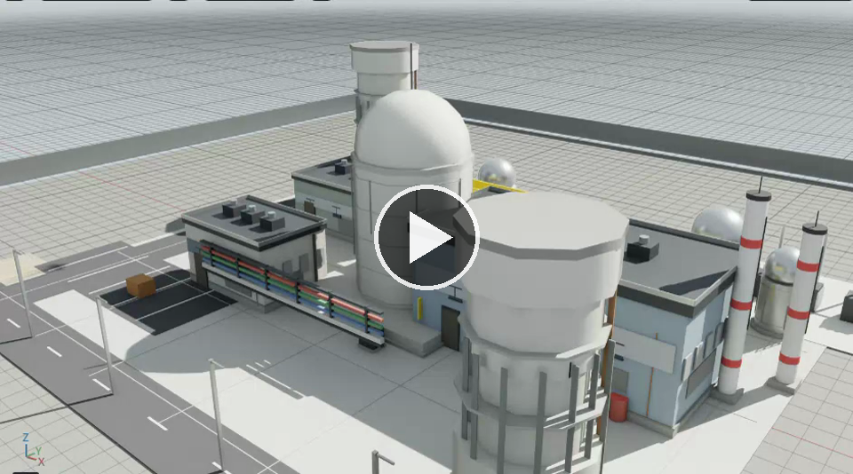
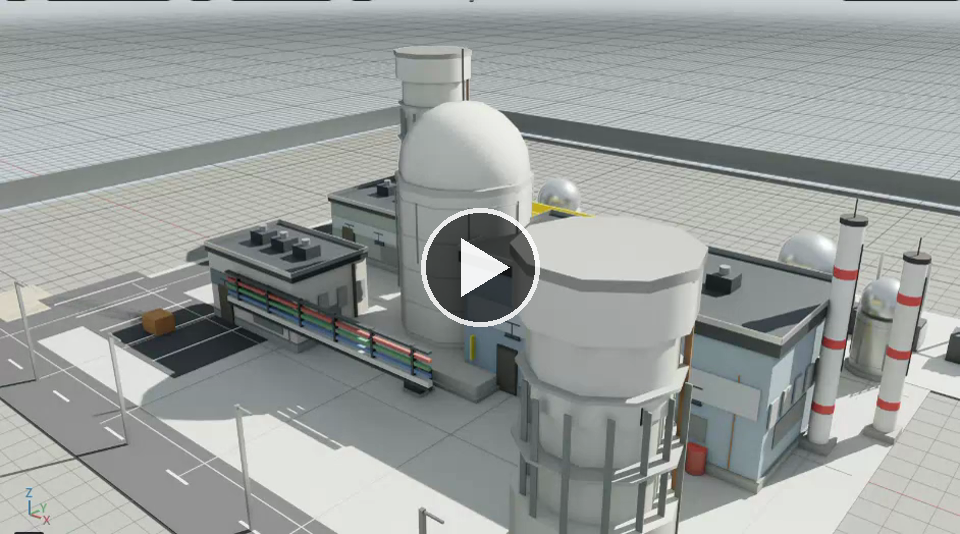
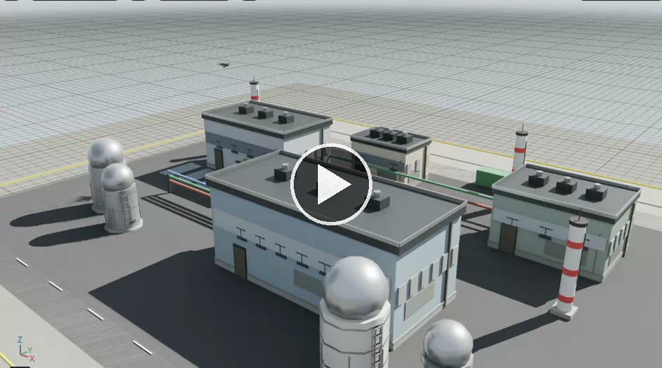
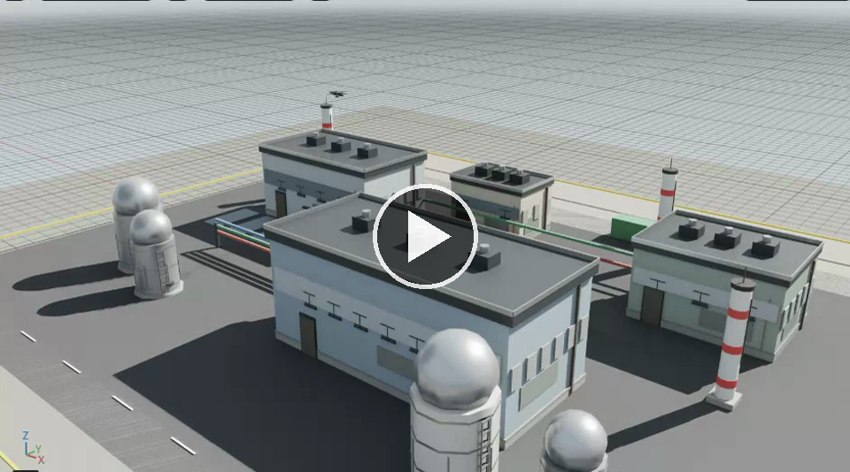

# Autonomous Policy Transfer for GPS-Denied UAV Infrastructure Inspection

**Research Artifact · Isaac Sim / Isaac Lab Implementation**

[](https://www.python.org/)
[](https://developer.nvidia.com/isaac-sim)
[](https://gymnasium.farama.org/)
[](#)
[](#)
[](#)

> **Paper:** Autonomous Policy Transfer for GPS-Denied UAV Infrastructure Inspection  
> **Authors:** Uddin Md. Borhan, Bingqing Du, Arif Raza, Jianqiang Li, and Jie Chen  
> **Affiliation:** College of Computer Science and Software Engineering, Shenzhen University, China  


---

## 1. Overview

<p align="justify">This repository provides the paper-aligned implementation for autonomous UAV infrastructure inspection in GPS-denied environments.</p>

<p align="justify">The implementation uses **Isaac Sim / Isaac Lab** to evaluate a UAV inspection policy under visually degraded localization conditions. The policy learns an **Optimal Speed Decision (OSD)** behavior and combines:</p>

- **Deep Reinforcement Learning (DRL)** using PPO-style policy learning,
- **Fuzzy reasoning** over visual texture, illumination, wind, and trajectory adherence,
- **Off-Policy Critic-Based Reward Shaping (OP-CBRS)** using offline uniform-speed rollouts,
- **Simulation-to-Simulation (Sim2Sim) transfer** from a source power-plant domain to a target industrial domain,
- **Proxy-VSLAM / optional cuVSLAM input** for GPS-denied localization experiments,
- **Paper-level metrics, trajectories, heatmaps, decision plots, and compact result packaging**.

<p align="justify">The central goal is to study how an autonomous UAV can complete multi-waypoint inspection routes while balancing localization reliability, route completion, execution time, and energy consumption.</p>

---

## 2. Main Workflow

<p align="justify">UAV inspection in GPS-denied environments is difficult because sparse visual texture, localization drift, delayed reward feedback, and cross-domain visual changes jointly affect route completion and inspection quality.</p>

<p align="justify">The implemented system addresses this through a unified policy-learning pipeline:</p>

```text
Offline uniform-speed rollouts
        ↓
OP-CBRS potential library construction
        ↓
Source-domain PPO OSD training in e1
        ↓
Source-domain evaluation
        ↓
Sim2Sim fine-tuning from e1 to e2
        ↓
Baseline evaluation in e2
        ↓
Transferred-policy evaluation in e2
        ↓
Paper metrics, figures, selected episodes, and compact result package
```

### 2.1 Domains

| Domain | Meaning | Route |
|---|---|---|
| `e1` | Source power-plant / nuclear-style inspection domain | 16-waypoint route |
| `e2` | Target industrial transfer domain | 12-waypoint route |

### 2.2 Main Methods

| Component | Purpose |
|---|---|
| OSD | Learns/adapts scalar UAV speed between `v_min` and `v_max`. |
| Fuzzy logic | Converts texture, illumination, wind, and adherence cues into interpretable memberships. |
| OP-CBRS | Uses offline uniform-speed rollouts to construct potential-based shaping signals. |
| Sim2Sim transfer | Fine-tunes and recalibrates the policy from source domain `e1` to target domain `e2`. |
| Proxy-VSLAM | Simulates GPS-denied pose noise, drift, and tracking quality degradation. |
| cuVSLAM mode | Optional external Isaac ROS Visual SLAM odometry path. |

### 2.3 System Model

<p align="center">
  
</p>

<p align="justify">Proposed UAV inspection framework. Uniform-speed tasks collect offline episodes and train potential functions. Fuzzy reasoning over texture, illumination, wind, and adherence supports potential selection for OSD training with OP-CBRS. The learned policy adapts from source environment <code>e1</code> to target environment <code>e2</code> through Sim2Sim fuzzy recalibration.</p>

---

## 3. Repository Layout

<p align="justify">Recommended layout:</p>

```text
IsaacLab/
├── source/
│   └── standalone/
│       └── npp_drone_inspection/
│           ├── drone.py                       # Main Isaac Sim / Isaac Lab implementation
│           ├── models/                        # Saved PPO / transfer models
│           └── logs/                          # Isaac Lab / PPO logs
├── figs/                                     # Paper system model and result figures: 1.png ... 6.png
├── images/                                   # Simulation rendering screenshots used in README
├── videos/                                   # Simulation screen recordings and preview images
└── README.md

~/uav_inspection/
├── logs/
├── metrics/
├── figures/
├── trajectories/
├── models/
├── op_cbrs/
├── paper_selected_figures/
└── paper/                                    # Compact paper package created by pipeline
```

<p align="justify">The main script is:</p>

```bash
source/standalone/npp_drone_inspection/drone.py
```

<p align="justify">All paper-aligned outputs are written to:</p>

```bash
~/uav_inspection
```

---

## 4. Environment Requirements

### Required

- Ubuntu 20.04 / 22.04
- NVIDIA GPU recommended
- Isaac Sim / Isaac Lab installation
- Python 3.10 through Isaac Lab
- `gymnasium`
- `numpy`
- `pandas` for final result-table generation
- `zip` and `rsync` for final artifact packaging

### Optional

- Isaac ROS Visual SLAM / cuVSLAM
- ROS 2 Humble environment for real visual odometry input
- Custom drone USD / USDZ asset
- Custom plant USD / USDZ / USDC asset
- HDRI environment map

<p align="justify">The script imports Isaac Sim directly. Therefore, run it through Isaac Lab:</p>

```bash
cd ~/IsaacLab
./isaaclab.sh -p source/standalone/npp_drone_inspection/drone.py --help
```

<p align="justify">Do **not** run `drone.py` with a normal system Python interpreter.</p>

---

## 5. Detailed Code Tour: `drone.py`

<p align="justify">The file `drone.py` is the complete implementation entry point for the Isaac Sim / Isaac Lab UAV inspection experiments. It combines environment construction, GPS-denied localization simulation, fuzzy OSD control, OP-CBRS reward shaping, PPO training, Sim2Sim transfer, evaluation, metric logging, and figure generation in one reproducible script.</p>

### 5.1 High-Level File Structure

| Code block / class | Role in the implementation |
|---|---|
| `parse_args()` | Defines all command-line controls for simulation, training, transfer, evaluation, SLAM, metrics, and figure export. |
| `CuvslamOdomReceiver` | Receives external Isaac ROS Visual SLAM odometry through either direct `rclpy` subscription or UDP JSON fallback. |
| `NPPDroneGymEnv` | Main Gymnasium environment. It builds the Isaac scene, manages UAV motion, simulates proxy-VSLAM, computes fuzzy memberships, applies OP-CBRS shaping, and records metrics. |
| `main()` | Creates the Isaac `SimulationApp`, builds the environment, dispatches each experiment mode, trains PPO, evaluates policies, and writes the algorithm manifest. |

<p align="justify">The implementation is designed so that the same script can be used for debugging, offline OP-CBRS data collection, source-domain training, target-domain transfer, baseline evaluation, final policy evaluation, and compact paper-package generation.</p>

---

### 5.2 Command-Line Interface and Experiment Control

<p align="justify">The `parse_args()` function exposes all important experimental settings. The arguments are grouped into six practical categories.</p>

#### A. Execution and algorithm mode

| Argument | Purpose |
|---|---|
| `--mode` | Selects the running stage: training, evaluation, OP-CBRS collection, Sim2Sim transfer, or full paper pipeline. |
| `--headless` | Runs Isaac Sim without GUI, useful for server-side training/evaluation. |
| `--device` | Selects `cpu` or `cuda`. |
| `--seed` | Controls deterministic initialization. |
| `--renderer` | Selects the Isaac Sim renderer, e.g., `RayTracedLighting` or `PathTracing`. |

<p align="justify">Supported modes:</p>

| Mode | What it does | Typical output |
|---|---|---|
| `random` | Runs the analytic OSD + fuzzy + OP-CBRS inspection controller for demonstration and debugging. | Step/episode metrics, trajectory files, rendered figures. |
| `collect_uniform_speed` | Collects fixed-speed offline rollouts for the OP-CBRS potential library. | Uniform-speed CSV data and potential-library inputs. |
| `build_op_cbrs_library` | Builds or rebuilds the OP-CBRS potential library from existing collected data. | `op_cbrs_library.json`. |
| `train_e1_osd` | Trains the source-domain PPO OSD policy in `e1`. | `osd_fuzzy_opcbrs_source_e1.zip`. |
| `transfer_e2` | Fine-tunes the source model in the target domain `e2`. | `osd_fuzzy_opcbrs_transfer_e2.zip`. |
| `eval_baselines` | Evaluates uniform-speed and analytic baselines in the selected domain. | Baseline metric CSVs and figures. |
| `eval_transfer` | Evaluates the source or transferred PPO policy. | Transfer metric CSVs, trajectories, heatmaps, and figures. |
| `paper_pipeline` | Runs the full pipeline: collect, build library, train source, transfer, evaluate baselines, evaluate transfer. | Complete paper-aligned output package. |

#### B. Domain and route configuration

| Argument | Purpose |
|---|---|
| `--sim-env-id e1` | Uses the source power-plant / nuclear-style domain with a 16-waypoint route. |
| `--sim-env-id e2` | Uses the target industrial domain with a 12-waypoint route. |
| `--world-size` | Controls the simulation world size. |
| `--inspection-reach-radius` | Distance threshold for accepting an inspection waypoint as reached. |
| `--max-episode-steps` | Soft step budget for an episode. |
| `--allow-timeout-before-route-complete` | Allows timeout before all route waypoints are reached. By default, evaluation modes prefer route completion. |

#### C. OSD, PPO, and transfer settings

| Argument | Purpose |
|---|---|
| `--osd-vmin` / `--osd-vmax` | Defines the scalar OSD action range in m/s. |
| `--total-timesteps` | PPO source-domain training budget. |
| `--transfer-timesteps` | PPO target-domain fine-tuning budget. |
| `--train-episodes` | Optional episode-based stop condition for source training. |
| `--transfer-episodes` | Optional episode-based stop condition for Sim2Sim transfer. |
| `--source-model` | Source `e1` model path used for transfer or evaluation. |
| `--transfer-model` | Target `e2` transferred model path used for evaluation. |
| `--policy-analytic-blend` | Blends learned PPO speed with analytic fuzzy OSD speed for safer transfer. |
| `--adaptive-speed-floor` | Prevents the transferred policy from becoming too slow in low-risk segments. |
| `--yaw-gain` | Waypoint-facing yaw controller gain. |
| `--velocity-memory` | Smooths the commanded velocity. Lower values track speed commands faster. |

#### D. OP-CBRS and baseline settings

| Argument | Purpose |
|---|---|
| `--uniform-speeds` | Defines fixed-speed tasks, e.g., `0.25,0.50,0.75,1.00`. |
| `--offline-episodes-per-speed` | Number of offline episodes collected per uniform speed. |
| `--potential-library` | Path to the OP-CBRS potential-library JSON file. |
| `--enable-op-cbrs` | Enables OP-CBRS-style potential shaping. |
| `--disable-op-cbrs` | Disables shaping but still logs potential-related values. |

#### E. SLAM, perception, and ROS 2 settings

| Argument | Purpose |
|---|---|
| `--slam-mode proxy` | Uses the built-in proxy-VSLAM model with drift/noise/tracking degradation. |
| `--slam-mode gt` | Uses ground-truth pose for debugging only. |
| `--slam-mode cuvslam` | Uses external Isaac ROS Visual SLAM odometry. |
| `--enable-ros2-camera-pub` | Enables Isaac Sim ROS 2 Bridge camera publishing. |
| `--ros2-domain-id` | Sets `ROS_DOMAIN_ID`. |
| `--left-image-topic`, `--right-image-topic` | Stereo image topics expected by Isaac ROS Visual SLAM. |
| `--cuvslam-odom-topic` | Odometry topic used as GPS-denied pose input. |
| `--cuvslam-odom-udp-port` | UDP fallback port for odometry forwarding. |
| `--slam-drift-pos-per-sec` | Proxy-SLAM accumulated drift rate. |
| `--slam-pos-noise-std`, `--slam-yaw-noise-std`, `--slam-vel-noise-std` | Proxy-SLAM pose, yaw, and velocity noise levels. |
| `--slam-tracking-loss-prob` | Probability of temporary tracking degradation. |
| `--depth-noise-std` | Noise level for proxy depth-ray perception. |

#### F. Output, metrics, and figure settings

| Argument | Purpose |
|---|---|
| `--output-root` | Root output folder, normally `~/uav_inspection`. |
| `--metrics-dir` | Folder for paper metric CSV files. |
| `--trajectory-dir` | Folder for per-episode trajectory records. |
| `--figure-dir` | Folder for paper-style figures. |
| `--step-metrics-csv` | Optional custom per-step metric CSV path. |
| `--episode-metrics-csv` | Optional custom per-episode metric CSV path. |
| `--summary-json` | Optional cumulative summary JSON path. |
| `--disable-paper-figures` | Disables automatic figure rendering. |
| `--disable-trajectory-record` | Disables trajectory CSV/JSON export. |
| `--heatmap-grid-size` | Grid size for saved perception and coverage heatmaps. |

---

### 5.3 `CuvslamOdomReceiver`: External Visual-SLAM Input

<p align="justify">`CuvslamOdomReceiver` allows the same environment to run with external Isaac ROS Visual SLAM odometry.</p>

<p align="justify">It supports two odometry paths:</p>

| Path | How it works | When to use |
|---|---|---|
| Direct `rclpy` subscription | Subscribes to `/visual_slam/tracking/odometry` from inside Isaac Sim Python. | Use when `rclpy` is available in the Isaac Sim Python environment. |
| UDP JSON fallback | Receives forwarded odometry packets on UDP port `14555`. | Use when Isaac Sim Python and ROS 2 Humble use incompatible Python versions. |

<p align="justify">Important methods:</p>

| Method | Purpose |
|---|---|
| `quat_to_yaw()` | Converts quaternion orientation into yaw angle. |
| `_start_udp_receiver()` | Opens the UDP socket for fallback odometry reception. |
| `_try_start_rclpy_receiver()` | Attempts to subscribe directly to the ROS 2 odometry topic. |
| `_rclpy_odom_cb()` | Converts ROS 2 `Odometry` messages into internal pose/velocity values. |
| `_poll_udp()` | Reads UDP JSON odometry packets. |
| `get_latest()` | Returns the most recent odometry if it is fresh enough. |
| `close()` | Cleans up ROS 2 node and UDP socket resources. |

<p align="justify">This class is important because the paper target is GPS-denied inspection. The policy should receive localization information from a VSLAM-like source rather than assuming perfect GPS.</p>

---

### 5.4 `NPPDroneGymEnv`: Main UAV Inspection Environment

<p align="justify">`NPPDroneGymEnv` is the main environment class. It inherits from `gym.Env` and provides standard `reset()` and `step()` methods for PPO and evaluation.</p>

<p align="justify">The environment is responsible for:</p>

- creating the Isaac Sim world,
- creating the UAV, buildings, towers, tanks, stacks, fences, roads, and industrial structures,
- constructing the source `e1` and target `e2` inspection domains,
- creating stereo camera prims and optional ROS 2 camera publishing,
- simulating proxy-VSLAM drift, noise, tracking loss, and recovery,
- defining the scalar OSD action space,
- generating observations for PPO,
- applying fuzzy reasoning for texture, illumination, wind, and adherence,
- applying OP-CBRS potential-based reward shaping,
- logging per-step and per-episode paper metrics,
- exporting trajectories, heatmaps, and paper-style figures.

---

### 5.5 Environment Initialization

<p align="justify">The `__init__()` method configures the full simulation and learning environment.</p>

<p align="justify">Main initialization groups:</p>

| Group | Key variables / arguments | Purpose |
|---|---|---|
| Simulation setup | `world_size`, `num_obstacles`, `num_rays`, `dt`, `render_sim` | Defines the physical and rendering scale of the environment. |
| Asset setup | `drone_usd`, `plant_usd`, `hdri_path`, `save_stage` | Allows imported drone/plant assets and optional stage saving. |
| OSD speed range | `osd_vmin`, `osd_vmax` | Defines the paper-aligned scalar speed range. |
| Paper output | `output_root`, `metrics_dir`, `trajectory_dir`, `figure_dir` | Creates all folders needed for reproducible results. |
| Domain controls | `sim_env_id`, `domain_randomization`, `route_randomization`, `obstacle_randomization` | Controls source/target domain behavior and randomization. |
| SLAM controls | `slam_mode`, drift/noise settings, ROS 2 topics | Defines proxy-SLAM or cuVSLAM behavior. |
| Safety and transfer shield | `policy_analytic_blend`, `adaptive_speed_floor`, `obstacle_avoidance_gain`, `yaw_gain`, `velocity_memory` | Improves route completion and safe waypoint tracking during transfer. |
| Metrics state | `summary_counts`, `trajectory_records`, `episode_metrics` | Stores paper-level metrics and per-episode trajectories. |

<p align="justify">The environment also verifies the route length at startup. For `e1`, it expects 16 inspection waypoints. For `e2`, it expects 12 inspection waypoints. This protects the evaluation from accidentally using an outdated or incomplete route definition.</p>

---

### 5.6 Action Space and Observation Space

<p align="justify">The implemented action is paper-aligned with the OSD formulation.</p>

```python
self.action_space = spaces.Box(
    low=np.array([-1.0], dtype=np.float32),
    high=np.array([1.0], dtype=np.float32),
    dtype=np.float32,
)
```

<p align="justify">The PPO policy outputs one normalized scalar action in `[-1, 1]`. The environment converts it into a physical speed between `v_min` and `v_max`:</p>

```text
speed_alpha = 0.5 * (action + 1)
policy_speed = v_min + speed_alpha * (v_max - v_min)
```

<p align="justify">This means the learned policy does **not** directly control `vx`, `vy`, `vz`, or yaw-rate. Instead, it chooses the scalar inspection speed. The low-level waypoint tracker converts this speed into body-frame motion toward the active inspection waypoint.</p>

<p align="justify">The observation vector includes:</p>

| Observation group | Purpose |
|---|---|
| SLAM position | Estimated GPS-denied position. |
| SLAM velocity | Estimated motion state. |
| Yaw sine/cosine | Orientation representation without angle discontinuity. |
| IMU-like acceleration and gyro | Motion cues for policy learning. |
| Target relative position | Direction and distance to the active inspection waypoint. |
| Camera/feature cues | Visual texture and target visibility indicators. |
| Depth rays | Obstacle/scene proximity information. |
| SLAM tracking quality | Proxy/cuvSLAM localization reliability. |
| Previous OSD action | Temporal control context. |
| Mission progress | Route progress and waypoint status. |

---

### 5.7 `reset()`: Episode Initialization

<p align="justify">The `reset()` method prepares a new inspection episode.</p>

<p align="justify">Main operations:</p>

1. Resets velocity, yaw, IMU-like signals, previous action, and step count.
2. Applies domain randomization when enabled.
3. Checks that `e1` has 16 waypoints and `e2` has 12 waypoints.
4. Places the UAV at a domain-specific starting location and altitude.
5. Resets the current target index and route progress.
6. Resets proxy-SLAM / cuVSLAM state.
7. Starts a new paper-metric episode record.
8. Synchronizes the visual UAV and sensors in the Isaac scene.
9. Returns the initial observation.

<p align="justify">This makes each evaluation episode self-contained and ensures that all output metrics correspond to a clean route attempt.</p>

---

### 5.8 `step()`: OSD Speed Selection, Tracking, and Reward

<p align="justify">The `step()` method is where the learned OSD action becomes UAV motion.</p>

<p align="justify">The control sequence is:</p>

```text
PPO scalar action
        ↓
convert normalized action to physical speed
        ↓
collect fuzzy navigation metrics
        ↓
compute analytic fuzzy OSD speed cap
        ↓
blend PPO speed with analytic OSD safety shield
        ↓
apply risk-aware speed floor
        ↓
slow near waypoints to avoid overshoot
        ↓
convert scalar speed to body-frame waypoint tracking
        ↓
add local obstacle avoidance
        ↓
track altitude and yaw
        ↓
update velocity, position, SLAM, scene, reward, and logs
```

<p align="justify">Important details:</p>

| Component | What it does |
|---|---|
| PPO speed | Main learned scalar speed from the policy. |
| Analytic OSD cap | Fuzzy safety cap based on texture, illumination, wind, and adherence. |
| `policy_analytic_blend` | Controls how much analytic fuzzy OSD is mixed with learned speed. |
| `adaptive_speed_floor` | Prevents stalled policies when the route is safe. |
| Near-waypoint slowdown | Reduces overshoot near the target. |
| Local obstacle avoidance | Adds deterministic local repulsion while keeping the policy action scalar. |
| Altitude floor | Prevents the UAV from grazing roofs/chimneys. |
| Velocity memory | Smooths commanded velocity for stable motion. |
| No-progress watchdog | Stops deadlocked runs without affecting successful route-completion evaluation. |

<p align="justify">The method then calls `_compute_reward()` and records the transition. If the route is complete, the episode is finalized and figures/metrics can be saved.</p>

---

### 5.9 Scene and Sensor Construction

<p align="justify">The environment builds either a procedural plant-style scene, an industrial target scene, or an imported asset scene.</p>

<p align="justify">Important scene functions:</p>

| Function | Purpose |
|---|---|
| `_build_scene()` | Main scene-construction entry point. |
| `_create_lighting()` | Adds lighting/HDRI-style visual conditions. |
| `_create_material_palette()` | Creates materials for concrete, metal, roads, towers, and visual landmarks. |
| `_create_power_plant()` | Creates or imports the source power-plant-style scene. |
| `_create_warehouse_industrial_layout()` | Builds the target industrial `e2` layout. |
| `_create_procedural_power_plant()` | Builds the procedural source `e1` plant. |
| `_create_reactor_containment()` | Adds dome/reactor-style source-domain structures. |
| `_create_substation()` | Adds substation-like inspection structures. |
| `_create_visual_landmarks()` | Adds feature-rich points used by proxy-VSLAM and heatmaps. |
| `_create_perimeter_fence()` | Adds boundary/fence geometry. |
| `_create_drone()` | Creates or imports the UAV model. |
| `_create_sensor_rig_visuals()` | Adds visual sensor rig geometry. |
| `_create_stereo_camera_prims()` | Creates left/right stereo cameras. |
| `_setup_ros2_stereo_camera_graph()` | Creates ROS 2 camera-publishing graph for cuVSLAM mode. |

<p align="justify">The scene functions separate visual rendering from learning logic. This is useful because the same policy-learning code can be evaluated with procedural geometry, imported plant assets, or ROS 2 camera streaming.</p>

---

### 5.10 Route Construction and Domain Difference

<p align="justify">The inspection route is generated by `_build_boustrophedon_targets()`.</p>

| Domain | Route design |
|---|---|
| `e1` | Source power-plant route with 16 waypoints. |
| `e2` | Target industrial route with 12 waypoints. |

<p align="justify">The route follows a boustrophedon-style coverage pattern. This is suitable for infrastructure inspection because the UAV sweeps across inspection objects instead of only flying point-to-point.</p>

<p align="justify">Related helper functions:</p>

| Function | Purpose |
|---|---|
| `_coverage_layout_metadata()` | Provides route/inspection-area metadata for figures. |
| `_generate_targets_from_plant_bbox()` | Generates targets from an imported plant bounding box. |
| `_point_near_route_xy()` | Checks whether a point lies near the planned inspection route. |
| `_dist_point_segment()` / `_point_segment_distance_xy()` | Compute route-adherence distances. |

---

### 5.11 Proxy-VSLAM and GPS-Denied Localization

<p align="justify">The default experiments use proxy-VSLAM through:</p>

```bash
--slam-mode proxy
```

<p align="justify">Proxy-VSLAM simulates GPS-denied localization effects using:</p>

- accumulated positional drift,
- instantaneous position noise,
- yaw noise,
- velocity noise,
- feature-dependent tracking quality,
- random tracking-loss events,
- recovery dynamics.

<p align="justify">Important methods:</p>

| Function | Purpose |
|---|---|
| `_reset_navigation_proxy()` | Initializes SLAM pose, drift, and quality at episode start. |
| `_update_navigation_proxy()` | Updates SLAM state after each motion step. |
| `_update_proxy_inertial()` | Updates IMU-like acceleration and angular velocity. |
| `_localization_error()` | Computes localization error for `Aloc` and drift metrics. |
| `_target_rel_slam()` | Computes target direction using SLAM-estimated pose. |
| `_camera_features()` | Builds feature/visibility cues from camera geometry. |
| `_estimate_visible_feature_count()` | Estimates how many useful visual features are visible. |

<p align="justify">In `--slam-mode cuvslam`, the environment can use the latest external odometry from `CuvslamOdomReceiver`. This supports future experiments with Isaac ROS Visual SLAM instead of only proxy-SLAM.</p>

---

### 5.12 Fuzzy Reasoning and OSD Memberships

<p align="justify">Fuzzy reasoning converts continuous visual and motion cues into interpretable memberships.</p>

<p align="justify">Important functions:</p>

| Function | Membership / value |
|---|---|
| `_texture_membership()` | Computes `mu_T`, the visual texture membership. |
| `_illumination_membership()` | Computes `mu_L`, the illumination membership. |
| `_wind_stability_membership()` | Computes `mu_W`, the wind-stability membership. |
| `_trajectory_adherence()` | Computes `mu_A`, the route-adherence membership. |
| `_update_fuzzy_coverage()` | Updates fuzzy coverage quality. |
| `_compute_osd_speed_memberships()` | Converts fuzzy memberships into LOW/MEDIUM/HIGH speed suitability and a scalar OSD speed. |
| `_collect_navigation_metrics()` | Collects all fuzzy, localization, speed, coverage, and OP-CBRS metrics for logging/reward calculation. |

<p align="justify">The main OSD logic uses:</p>

```text
mu_T  → texture / visual feature quality
mu_L  → illumination stability
mu_W  → wind stability
mu_A  → trajectory adherence
```

<p align="justify">The resulting speed is lower in risky states, such as low texture or poor adherence, and higher in safer feature-rich regions.</p>

---

### 5.13 OP-CBRS Potential Library and Reward Shaping

<p align="justify">The OP-CBRS part uses fixed-speed offline rollouts to create potential functions for reward shaping.</p>

<p align="justify">Important functions:</p>

| Function | Purpose |
|---|---|
| `_load_op_cbrs_library()` | Loads the potential library from JSON. |
| `_membership_bin()` | Converts fuzzy values into discrete bins. |
| `_op_cbrs_state_key()` | Builds a state key from fuzzy/context bins. |
| `_heuristic_state_potential()` | Provides a fallback potential when no library bin is available. |
| `_select_op_cbrs_potential()` | Selects the context-dependent potential value used for shaping. |
| `collect_uniform_speed_library()` | Collects fixed-speed task data for the library. |
| `build_library_from_existing_csv()` | Builds the JSON library from collected CSV data. |

<p align="justify">The reward-shaping idea is:</p>

```text
base reward + potential-based shaping
```

<p align="justify">The potential term gives the UAV denser feedback than sparse waypoint rewards. This helps the policy learn when intermediate states are desirable or risky, especially before drift or localization failure becomes severe.</p>

---

### 5.14 Reward Function and Episode Termination

<p align="justify">The final reward is computed by `_compute_reward()`.</p>

<p align="justify">The reward combines:</p>

| Reward component | Purpose |
|---|---|
| Progress reward | Encourages movement toward the active waypoint. |
| Waypoint reward | Rewards successful inspection waypoint arrival. |
| Deviation penalty | Penalizes poor route adherence. |
| Collision / proximity penalty | Discourages unsafe motion near structures. |
| Texture-sensitive localization penalty | Penalizes risky motion in low-feature regions. |
| Fuzzy coverage reward | Encourages inspection-quality improvement. |
| OP-CBRS shaping | Provides dense potential-based guidance. |
| Energy/speed consideration | Supports time-energy-aware behavior. |

<p align="justify">The episode can end because:</p>

- all inspection waypoints are reached,
- hard safety cap is reached,
- no-progress watchdog triggers,
- collision termination is enabled and a collision occurs,
- timeout is allowed and the step limit is reached.

<p align="justify">For paper evaluation, the commands usually use route-completion behavior so the episode does not stop too early before all inspection points are visited.</p>

---

### 5.15 Metrics, CSV Logging, and Paper Outputs

<p align="justify">The environment records both step-level and episode-level outputs.</p>

<p align="justify">Important functions:</p>

| Function | Purpose |
|---|---|
| `_start_paper_episode_metrics()` | Initializes a new metric record at episode start. |
| `_compute_paper_step_values()` | Computes per-step metrics such as speed, potential, localization error, coverage, and fuzzy memberships. |
| `_record_paper_step_metrics()` | Appends per-step values to the CSV logger and trajectory buffer. |
| `_append_csv_row()` | Writes rows into metric CSV files. |
| `_write_episode_trajectory_csv()` | Saves per-episode trajectory CSV. |
| `_finalize_paper_episode_metrics()` | Computes and writes final episode metrics. |
| `_save_episode_artifacts()` | Saves trajectory, figure, and interpretation artifacts. |
| `_write_algorithm_manifest()` | Writes a JSON summary of the algorithmic stage and configuration. |

<p align="justify">Typical outputs:</p>

```text
~/uav_inspection/metrics/paper_step_metrics.csv
~/uav_inspection/metrics/paper_episode_metrics.csv
~/uav_inspection/metrics/paper_summary.json
~/uav_inspection/trajectories/episode_XXXX_trajectory.csv
~/uav_inspection/figures/episode_XXXX_trajectory3d.png
~/uav_inspection/figures/episode_XXXX_decision_dynamics.png
~/uav_inspection/figures/episode_XXXX_perception_heatmap.png
~/uav_inspection/figures/episode_XXXX_visual_heatmap_sequence.png
```

---

### 5.16 Figure and Heatmap Generation

<p align="justify">The script automatically generates paper-style visual outputs when figure saving is enabled.</p>

<p align="justify">Important functions:</p>

| Function | Purpose |
|---|---|
| `_smooth_heatmap_array()` | Smooths heatmap values for visualization. |
| `_visible_feature_image_heatmap()` | Builds camera-like visual-feature heatmaps. |
| `_build_heatmap_array()` | Builds global coverage/feature heatmaps. |
| `_render_fuzzy_sequence_figure()` | Renders dual-camera heatmap sequences. |
| `_render_episode_figures()` | Generates trajectory, decision-dynamics, perception heatmap, and VSLAM-style figures. |

<p align="justify">The generated figures support the README and paper by showing:</p>

- 3D UAV trajectory,
- proxy-VSLAM map and route,
- adaptive speed response,
- OP-CBRS potential behavior,
- localization error,
- visual feature response,
- front/downward camera heatmap sequences.

---

### 5.17 PPO Training and Sim2Sim Transfer in `main()`

<p align="justify">The `main()` function creates the Isaac Sim application, imports Isaac/Usd modules, creates the environment, and dispatches each algorithmic mode.</p>

<p align="justify">Important inner functions:</p>

| Function | Purpose |
|---|---|
| `make_env()` | Creates `NPPDroneGymEnv` with all CLI settings. |
| `_osd_fuzzy_action()` | Analytic fuzzy OSD controller used for baseline and debugging. |
| `_uniform_speed_action()` | Fixed-speed policy used for OP-CBRS offline tasks. |
| `_rollout_action_policy()` | Runs a policy for a specified number of episodes. |
| `collect_uniform_speed_library()` | Collects uniform-speed rollouts. |
| `build_library_from_existing_csv()` | Builds OP-CBRS library from collected data. |
| `train_ppo_policy()` | Trains PPO in `e1` or fine-tunes in `e2`. |
| `evaluate_model()` | Loads and evaluates a trained PPO model. |
| `eval_baselines()` | Evaluates uniform-speed and analytic fuzzy baselines. |

<p align="justify">The mode-dispatch logic is:</p>

```text
random
  → run analytic OSD + fuzzy + OP-CBRS demonstration

collect_uniform_speed
  → collect fixed-speed rollouts for OP-CBRS

build_op_cbrs_library
  → build potential library JSON

train_e1_osd
  → train source PPO OSD policy in e1

transfer_e2
  → load source model and fine-tune in e2

eval_baselines
  → evaluate fixed-speed and analytic baselines

eval_transfer
  → evaluate source or transferred PPO model

paper_pipeline
  → collect data, build library, train source, transfer, evaluate, and write manifest
```

---

### 5.18 Recommended Reading Order for New Users

<p align="justify">For understanding the code quickly, read the file in this order:</p>

1. `parse_args()` to understand all experiment controls.
2. `NPPDroneGymEnv.__init__()` to understand environment configuration.
3. `_build_boustrophedon_targets()` to verify source/target routes.
4. `reset()` to understand episode initialization.
5. `step()` to understand OSD action conversion and low-level control.
6. `_collect_navigation_metrics()` to understand fuzzy state variables.
7. `_compute_osd_speed_memberships()` to understand fuzzy speed decisions.
8. `_select_op_cbrs_potential()` to understand potential selection.
9. `_compute_reward()` to understand final reward shaping.
10. `_finalize_paper_episode_metrics()` and `_render_episode_figures()` to understand output generation.
11. `main()` to understand how each command-line mode is executed.

---

### 5.19 Why This Code Tour Matters

<p align="justify">This code structure directly matches the paper workflow:</p>

```text
uniform-speed tasks
    → OP-CBRS potential library
    → PPO OSD source training
    → Sim2Sim target transfer
    → proxy/cuvSLAM GPS-denied evaluation
    → paper metrics, result tables, trajectories, and figures
```

<p align="justify">Therefore, the README is not only a usage guide. It also explains how each code block corresponds to the proposed UAV inspection framework.</p>


---

## 6. Main Output Metrics

<p align="justify">The script writes paper-style CSV files with episode-level and step-level statistics.</p>

| Metric | Meaning |
|---|---|
| `Psucc_episode` | Route success indicator. |
| `tau_i_sec` | Episode execution time. |
| `Dinc_episode` | Number of drift incidents. |
| `Aloc_episode` | Localization accuracy indicator. |
| `Econ_Wh_episode` | Estimated energy consumption. |
| `Etime_sec_episode` | Effective mission time. |
| `coverage_C` | Coverage score. |
| `mu_cvg_final` | Final fuzzy coverage membership. |
| `waypoints_reached` | Number of reached inspection waypoints. |
| `pre_drift_alerts` | Number of pre-drift fuzzy warnings. |
| `mean_speed_mps` | Mean scalar speed. |
| `mean_mu_T` | Mean texture membership. |
| `mean_mu_L` | Mean illumination membership. |
| `mean_mu_W` | Mean wind membership. |
| `mean_mu_A` | Mean trajectory-adherence membership. |
| `reward_sum` | Raw environment return. |
| `performance_reward_sum` | Performance-oriented reward for paper plots. |
| `op_cbrs_lib_hits` | Number of OP-CBRS library hits. |
| `op_cbrs_lib_misses` | Number of OP-CBRS library misses. |

---

## 7. Simulation Rendering Screenshots and Videos

<p align="justify">This section is intentionally placed after the code discussion so that the README first explains the repository and implementation, then shows simulation evidence.</p>

### 7.1 Media Folder Layout

<p align="justify">Place the screenshots, video preview images, and MP4 videos in the repository root as follows:</p>

```text
images/
├── Screenshot from 2026-05-13 21-05-19.png
└── Screenshot from 2026-05-19 19-06-59.png

videos/
├── simulation_demo_01.mp4
├── simulation_demo_01_preview.png
├── simulation_demo_02.mp4
├── simulation_demo_02_preview.png
├── simulation_demo_03.mp4
├── simulation_demo_03_preview.png
├── simulation_demo_04.mp4
└── simulation_demo_04_preview.png
```

### 7.2 Simulation Rendering Screenshots

<p align="justify">The screenshots show the UAV inspection scene, industrial/power-plant rendering, and visual inspection environment.</p>

<table>
<tr>
<td align="center"><br/><sub>Rendering view 1: UAV inspection e1 environment</sub></td>

<td align="center"><br/><sub>Rendering view 2: UAV inspection e2 environment</sub></td>
</tr>
</table>

### 7.3 Simulation Video Previews

<p align="justify">The following previews are clickable screenshots. Click a preview image to open the corresponding MP4 video from the `videos/` folder. This format is more reliable for GitHub README pages than embedding local MP4 files with HTML video tags.</p>

<table>
<tr>
<td align="center">
<a href="videos/simulation_demo_01.mp4">

</a>
<br/><sub><b>Simulation video 1:</b> UAV inspection run</sub>
</td>
<td align="center">
<a href="videos/simulation_demo_02.mp4">

</a>
<br/><sub><b>Simulation video 2:</b> policy execution view</sub>
</td>
</tr>
<tr>
<td align="center">
<a href="videos/simulation_demo_03.mp4">

</a>
<br/><sub><b>Simulation video 3:</b> route-following behavior</sub>
</td>
<td align="center">
<a href="videos/simulation_demo_04.mp4">

</a>
<br/><sub><b>Simulation video 4:</b> final rendering sequence</sub>
</td>
</tr>
</table>


## 8. Figures and Visual Results

### 8.1 Coverage, Localization, and Feature-Density Visualization

<p align="center">
  
</p>

<p align="justify">Isaac Sim coverage, localization, and feature-density visualization. The top row shows the source power-plant domain <code>e1</code>, and the bottom row shows the target industrial domain <code>e2</code>. Each row includes the coverage path, Isaac Sim scene, proxy-VSLAM trajectory, and visual-feature coverage heatmap.</p>

### 8.2 Fuzzy-Enhanced OSD Decision-Making

<p align="center">
  
</p>

<p align="justify">Fuzzy-enhanced OSD decision-making with OP-CBRS in <code>e2</code>. The figure shows the 3D UAV inspection trajectory, adaptive speed response, visual-feature response, and dual-camera heatmap sequence.</p>

### 8.3 OP-CBRS Potential and Pre-Drift Behavior

<p align="center">
  
</p>

<p align="justify">Relative OP-CBRS potential values for normal and drift-prone states. The normal state remains nearly stable, while the drift-prone state declines before fuzzy adaptation.</p>

### 8.4 Normalized Transfer Performance

<p align="center">
  
</p>

<p align="justify">Normalized transfer performance in <code>e2</code>. Higher values indicate better performance. The transferred policy provides strong time-energy efficiency, while the analytic OSD and uniform 1.00 m/s baselines provide lower drift.</p>

### 8.5 Original Reward and Fuzzy-Enhanced Potential

<p align="center">
  
</p>

<p align="justify">Original reward and fuzzy-enhanced OP-CBRS potential over a selected inspection window. The fuzzy-enhanced potential declines earlier than the sparse reward, providing an earlier risk-sensitive signal.</p>


---

## 9. Paper Result Tables

### 9.1 Target-Domain `e2` Evaluation

<p align="justify">This table compares all same-protocol target-domain <code>e2</code> policies using route success, execution time, drift incidents, localization accuracy, energy consumption, and mean speed. All policies complete the route, while the transferred OSD+Fuzzy+OP-CBRS policy gives the lowest average time and energy consumption. The analytic OSD and the 1.00 m/s uniform-speed baseline remain more conservative in terms of drift incidents, so the transferred policy should be interpreted mainly as improving time-energy efficiency while maintaining full route completion.</p>

| Policy | Episodes | Psucc (%) | τavg (s) | Dinc/Ep. | Aloc (%) | Econ (Wh) | Speed (m/s) |
|---|---:|---:|---:|---:|---:|---:|---:|
| Uniform-Speed-0.25 m/s | 50 | 100.00 | 114.46 | 1.28 | 99.82 | 6.27 | 0.718 |
| Uniform-Speed-0.50 m/s | 50 | 100.00 | 104.46 | 1.36 | 99.83 | 5.82 | 0.788 |
| Uniform-Speed-0.75 m/s | 50 | 100.00 | 96.57 | 1.14 | 99.81 | 5.47 | 0.851 |
| Uniform-Speed-1.00 m/s | 50 | 100.00 | 94.15 | 0.90 | 99.76 | 5.37 | 0.873 |
| Analytic OSD+Fuzzy+OP-CBRS | 50 | 100.00 | 94.15 | 0.90 | 99.76 | 5.37 | 0.873 |
| Transferred OSD+Fuzzy+OP-CBRS | 50 | 100.00 | 92.69 | 1.20 | 99.79 | 5.31 | 0.886 |

### 9.2 Welch t-Test Against Same-Protocol `e2` Baselines

<p align="justify">This table reports statistical comparisons between the transferred policy and each same-protocol target-domain baseline. Negative values of <code>Δτ</code> and <code>ΔE</code> indicate that the transferred policy reduces execution time and energy consumption. The p-values show that the time and energy reductions are statistically significant for all listed comparisons, while the drift differences are not statistically significant under the reported tests.</p>

| Compared baseline | Δτ (s) | pτ | ΔE (Wh) | pE | ΔDinc/Ep. | pD |
|---|---:|---:|---:|---:|---:|---:|
| Uniform-Speed-0.25 m/s | -21.78 | < 10^-50 | -0.97 | < 10^-50 | -0.08 | 0.693 |
| Uniform-Speed-0.50 m/s | -11.77 | < 10^-35 | -0.52 | < 10^-35 | -0.16 | 0.507 |
| Uniform-Speed-0.75 m/s | -3.88 | 9.60 × 10^-10 | -0.17 | 7.16 × 10^-10 | 0.06 | 0.782 |
| Uniform-Speed-1.00 m/s | -1.46 | 0.0196 | -0.064 | 0.0162 | 0.30 | 0.126 |
| Analytic OSD+Fuzzy+OP-CBRS | -1.46 | 0.0196 | -0.064 | 0.0162 | 0.30 | 0.126 |

### 9.3 Baseline and Ablation Evaluation

<p align="justify">This ablation table shows the contribution of the main modules. The configuration without OP-CBRS does not complete the full target-domain route, which indicates that dense potential-based shaping is important for reliable route-level learning. The configuration without OSD still completes the route, but the complete transferred framework provides a stronger balance between full route completion, localization accuracy, time, and energy.</p>

| Configuration | Psucc (%) | τavg (s) | Dinc/Ep. | Aloc (%) | Econ (Wh) | WP |
|---|---:|---:|---:|---:|---:|---:|
| Uniform-speed library (mean) | 100.00 | 102.41 | 1.17 | 99.81 | 5.74 | 12/12 |
| Analytic OSD+Fuzzy+OP-CBRS | 100.00 | 94.15 | 0.90 | 99.76 | 5.37 | 12/12 |
| PPO+OSD+Fuzzy w/o OP-CBRS | 0.00 | 72.00 | 0.96 | 99.07 | 4.04 | 9.58/12 |
| PPO+Fuzzy+OP-CBRS w/o OSD | 100.00 | 88.08 | 0.92 | 99.70 | 5.17 | 12/12 |
| PPO Sim2Sim Transfer + OP-CBRS | 100.00 | 92.69 | 1.20 | 99.79 | 5.31 | 12/12 |

### 9.4 Coverage and OP-CBRS Consistency

<p align="justify">This table summarizes coverage quality and OP-CBRS behavior across source training, transfer tuning, and final target-domain evaluation. The waypoint column confirms full route completion in each stage. The coverage and fuzzy-coverage values reflect the different route layouts of <code>e1</code> and <code>e2</code>, while the library-hit ratio indicates that the OP-CBRS potential library remains active during transfer and evaluation. The lower alert count in <code>e2</code> suggests more stable target-domain execution after adaptation.</p>

| Run | Waypoints | C | μcvg | Lib. hit | Alerts |
|---|---:|---:|---:|---:|---:|
| Source `e1` training | 16/16 | 0.500 | 0.393 | 0.550 | 31.20 |
| Transfer `e2` tuning | 12/12 | 0.415 | 0.290 | 0.540 | 2.08 |
| Transfer `e2` evaluation | 12/12 | 0.415 | 0.290 | 0.600 | 1.78 |

### 9.5 Source and Transfer Evaluation Summary

<p align="justify">This table gives a compact end-to-end summary of the learning and evaluation process. Source-domain PPO training verifies that the policy can complete the longer 16-waypoint route in <code>e1</code>. Transfer fine-tuning and final evaluation show that the learned policy remains effective in the 12-waypoint target domain <code>e2</code>. The selected best episode highlights the strongest individual transferred run, with complete route execution, perfect localization accuracy under the reported threshold, and the lowest energy among the summarized entries.</p>

| Run | Domain | Episodes | Waypoints | Psucc (%) | τavg (s) | Aloc (%) | Econ (Wh) |
|---|---|---:|---:|---:|---:|---:|---:|
| Source PPO training | `e1` | 291 | 16/16 | 100.00 | 96.08 | 97.67 | 5.33 |
| Transfer fine-tuning | `e2` | 50 | 12/12 | 100.00 | 94.01 | 99.81 | 5.36 |
| Final transferred evaluation | `e2` | 50 | 12/12 | 100.00 | 92.69 | 99.79 | 5.31 |
| Best selected episode | `e2` | 1 | 12/12 | 100.00 | 85.20 | 100.00 | 4.99 |

### 9.6 Result Interpretation

<p align="justify">The result tables should be read together rather than independently. The main evidence is that the transferred OSD+Fuzzy+OP-CBRS policy preserves complete route execution in the target domain while reducing time and energy compared with the same-protocol baselines. At the same time, the drift results show an efficiency-drift trade-off: the transferred policy is faster and more energy-efficient, but not uniformly better in drift incidents than the most conservative analytic or high-speed uniform baselines.</p>
<p align="justify">The transferred policy completes all target-domain episodes and achieves the best average execution time and energy consumption among the same-protocol `e2` policies. The analytic OSD and uniform 1.00 m/s baselines show lower drift incidents, while the transferred policy provides stronger time-energy efficiency. Therefore, the result claim should be stated as **improved time-energy efficiency under full route completion**, not as uniformly lower drift.</p>

---

## 10. Quick Start

### 10.1 Copy the script

<p align="justify">Place the final script here:</p>

```bash
~/IsaacLab/source/standalone/npp_drone_inspection/drone.py
```

<p align="justify">Create the folder if needed:</p>

```bash
mkdir -p ~/IsaacLab/source/standalone/npp_drone_inspection
```

### 10.2 Check the command-line interface

```bash
cd ~/IsaacLab
./isaaclab.sh -p source/standalone/npp_drone_inspection/drone.py --help
```

### 10.3 Run a short debug evaluation

```bash
cd ~/IsaacLab
export DEVICE=${DEVICE:-cuda}

./isaaclab.sh -p source/standalone/npp_drone_inspection/drone.py \
  --mode random --headless --device $DEVICE --slam-mode proxy \
  --sim-env-id e1 --output-root ~/uav_inspection \
  --max-episode-steps 1000 --inspection-reach-radius 2.00 \
  --disable-obstacle-randomization --disable-collision-termination \
  --num-obstacles 0
```

---

## 11. Reproduction Pipeline

<p align="justify">The following commands reproduce the paper-style workflow step by step.</p>

### Step 0: Initialize output

```bash
cd ~/IsaacLab
export DEVICE=${DEVICE:-cuda}

echo "Using DEVICE=$DEVICE"

rm -rf ~/uav_inspection
rm -rf source/standalone/npp_drone_inspection/logs/PPO_*

mkdir -p ~/uav_inspection/{logs,metrics,figures,trajectories,models,op_cbrs,paper_selected_figures}
```

---

### Step 1: Collect uniform-speed rollouts in source domain `e1`

```bash
./isaaclab.sh -p source/standalone/npp_drone_inspection/drone.py \
  --mode collect_uniform_speed --headless --device $DEVICE --slam-mode proxy \
  --sim-env-id e1 --output-root ~/uav_inspection \
  --offline-episodes-per-speed 25 --uniform-speeds 0.25,0.50,0.75,1.00 \
  --max-episode-steps 12000 --inspection-reach-radius 2.00 \
  --disable-domain-randomization -
